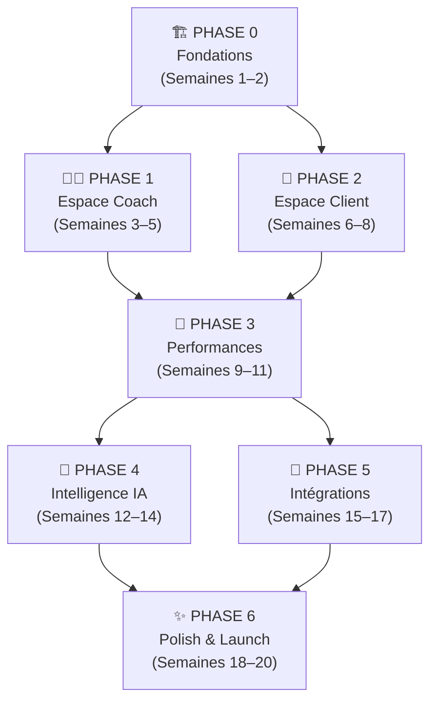
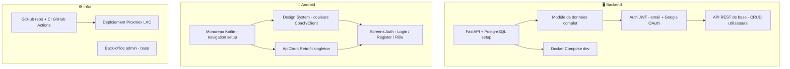
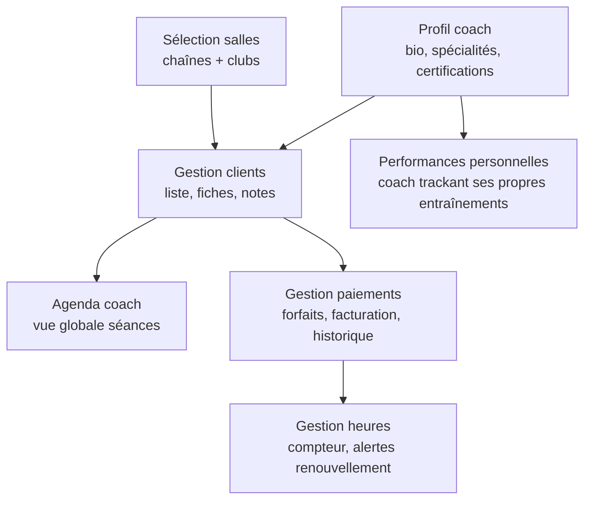
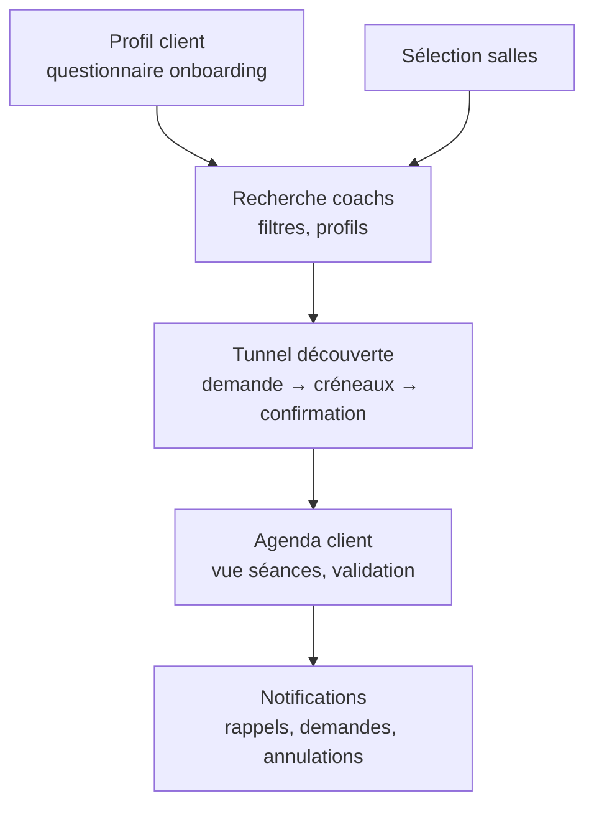
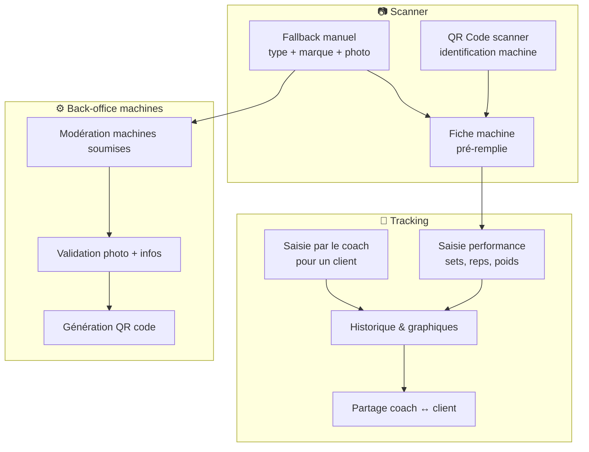
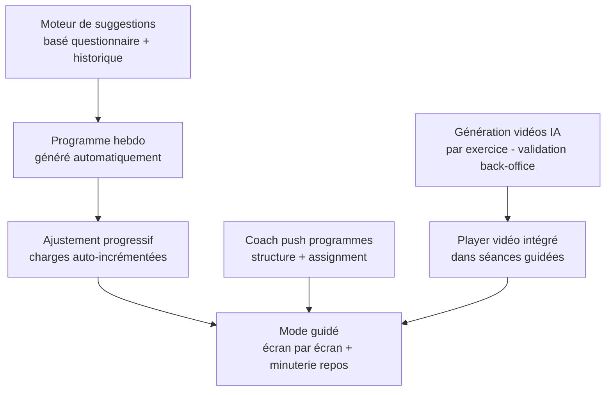
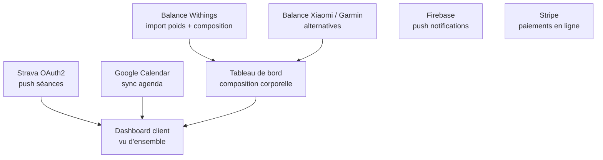
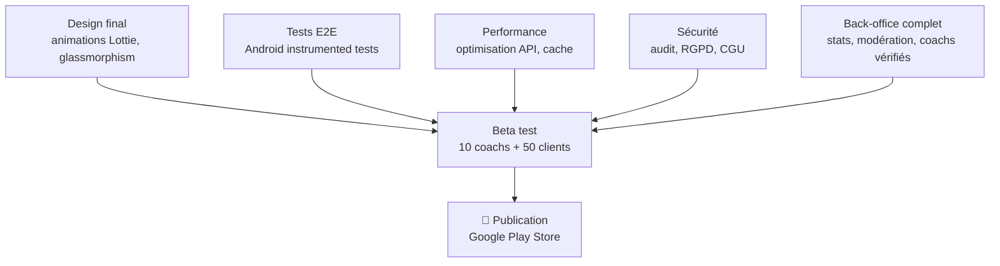

# MyCoach — Organigramme de développement

> Roadmap technique en 7 phases. Chaque phase est livrable et testable de façon indépendante.

---

## Vue d'ensemble

---

## Phase 0 — Fondations *(Sem. 1–2)*

**Livrables :** App installable, login fonctionnel, deux rôles distincts (coach/client), backend déployé.

---

## Phase 1 — Espace Coach *(Sem. 3–5)*

**Livrables :** Un coach peut créer son profil complet, gérer ses clients et ses paiements.

---

## Phase 2 — Espace Client *(Sem. 6–8)*

**Livrables :** Un client peut s'inscrire, trouver un coach, planifier une séance découverte.

---

## Phase 3 — Performances *(Sem. 9–11)*

**Livrables :** Tracking complet des performances, scanner QR, graphiques de progression.

---

## Phase 4 — Intelligence IA *(Sem. 12–14)*

**Livrables :** Séances solo intelligentes, programmes coach, vidéos pédagogiques IA sur chaque exercice.

---

## Phase 5 — Intégrations *(Sem. 15–17)*

**Livrables :** App connectée à l'écosystème fitness (Strava, balances, calendrier, paiements).

---

## Phase 6 — Polish & Launch *(Sem. 18–20)*

---

## 📊 Résumé des phases

| Phase | Contenu | Durée | Dépendances |
|-------|---------|-------|-------------|
| **0 — Fondations** | Backend, auth, Android base, CI/CD | 2 sem | — |
| **1 — Coach** | Profil, clients, paiements, agenda, perfs perso | 3 sem | Phase 0 |
| **2 — Client** | Profil, recherche coach, découverte, agenda | 3 sem | Phase 0 |
| **3 — Performances** | QR code, tracking, graphiques, back-office | 3 sem | Phases 1+2 |
| **4 — IA** | Suggestions, programmes, vidéos générées | 3 sem | Phase 3 |
| **5 — Intégrations** | Strava, balance, Calendar, Stripe | 3 sem | Phase 3 |
| **6 — Launch** | Design final, tests, sécurité, Play Store | 3 sem | Phases 4+5 |

**Durée totale estimée : ~20 semaines** *(5 mois, équipe 1–2 devs)*

---

## 🔑 Décisions techniques clés

| Décision | Choix | Raison |
|----------|-------|--------|
| Backend | FastAPI + PostgreSQL | Rapidité dev, scalable |
| Mobile | Android Kotlin d'abord | Marché FR + coût |
| Auth | JWT + Google OAuth2 | UX fluide |
| Vidéos | Génération IA (Kling/Runway) + CDN | Pas de coût production |
| Balance | API Withings en priorité | Meilleure API FR |
| DB dev | SQLite → PostgreSQL prod | Migration simple |
| Déploiement | Docker sur Proxmox LXC | Infrastructure existante |

---

*Version 1.0 — Rédigé le 25/02/2026*
