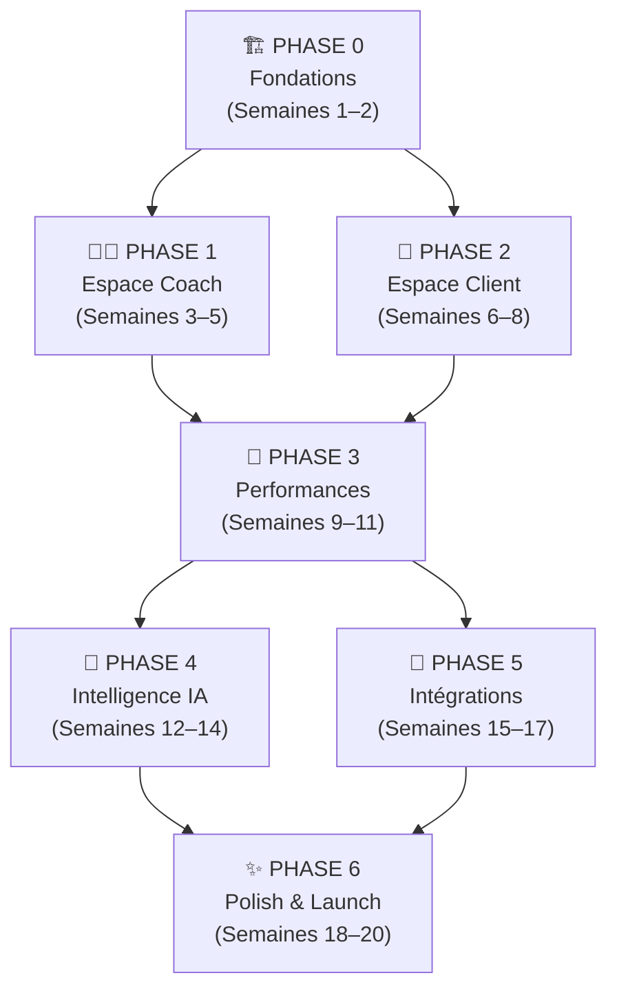
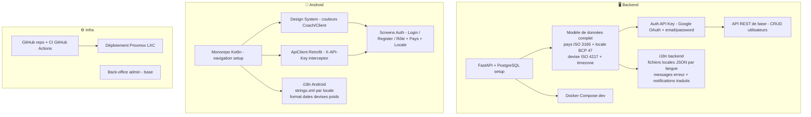
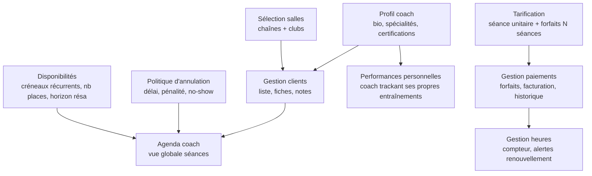
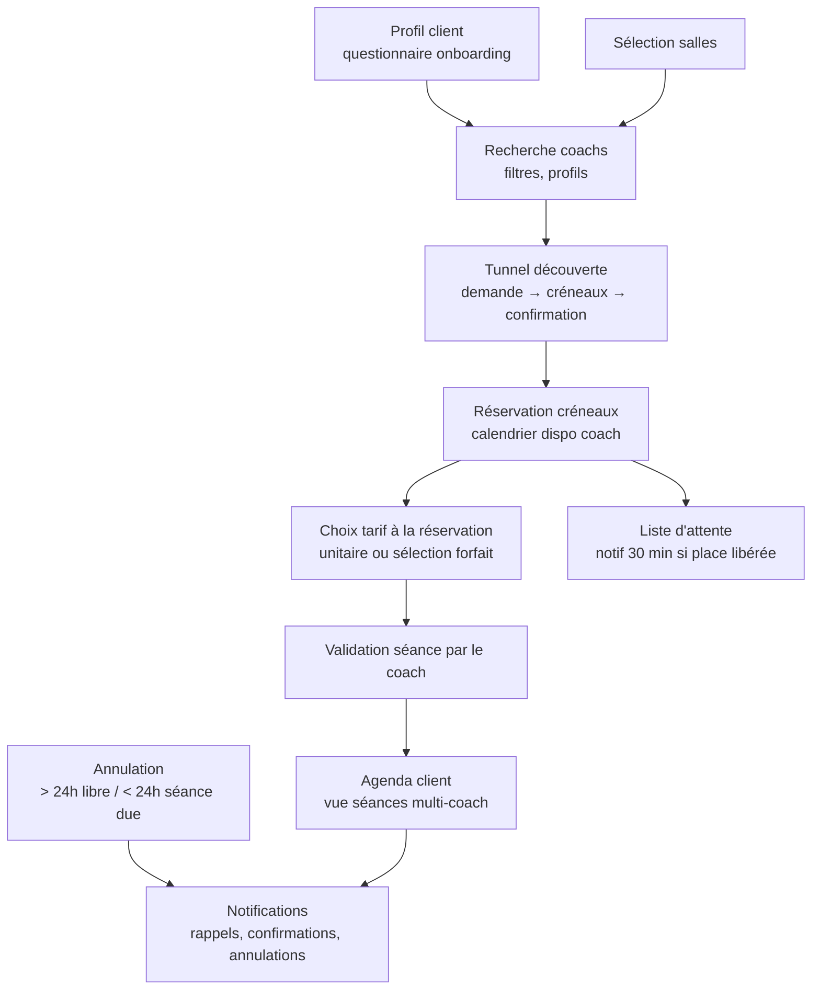
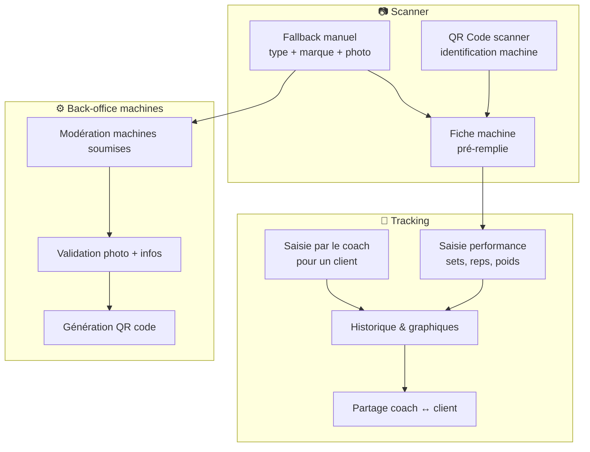
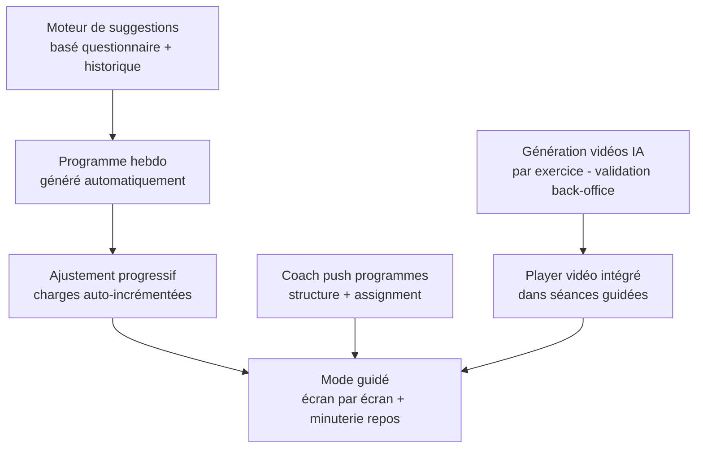
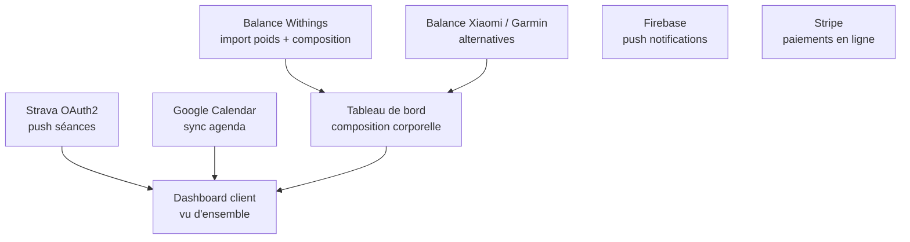
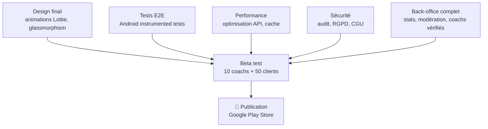

# MyCoach — Organigramme de développement

> Roadmap technique en 7 phases. Chaque phase est livrable et testable de façon indépendante.

---

## ✅ Définition du Done — Rappel (règle absolue)

> **Une tâche n'est terminée que si elle est committée avec ses tests.**

Pour chaque feature implémentée, le commit Git doit contenir :

| Quoi | Critère |
|------|---------|
| **Code** | Feature complète selon les specs |
| **Tests passants** | Au moins 1 test couvrant le cas nominal (happy path) |
| **Tests non passants** | Au moins 1 test par règle métier (erreur, limite, accès refusé) |
| **Tous les tests verts** | `pytest` ou `./gradlew test` → 0 failure, 0 error |
| **PROGRESS.md** | Tâche marquée ✅ |

> Format du message de commit : `[PHASE-X][TASK-Y] Description + tests`
>
> ⛔ **Commit interdit** si un test est rouge ou si les tests manquent.
> Voir `docs/CODING_AGENT.md §10` pour les exemples complets (DoD + paires passant/non passant).

---

## Vue d'ensemble



---

## Phase 0 — Fondations *(Sem. 1–2)*



**Livrables :** App installable, login fonctionnel, deux rôles distincts (coach/client), backend déployé.

---

## Phase 1 — Espace Coach *(Sem. 3–5)*



**Livrables :** Un coach peut créer son profil complet, configurer ses tarifs (unitaire + forfaits), ses disponibilités, sa politique d'annulation, et gérer ses clients et paiements.

---

## Phase 2 — Espace Client *(Sem. 6–8)*



**Livrables :** Un client peut s'inscrire, trouver un coach, réserver un créneau, choisir son tarif (unitaire ou forfait), gérer ses annulations avec les règles de pénalité, et rejoindre une liste d'attente.

---

## Phase 3 — Performances *(Sem. 9–11)*



**Livrables :** Tracking complet des performances, scanner QR, graphiques de progression.

---

## Phase 4 — Intelligence IA *(Sem. 12–14)*



**Livrables :** Séances solo intelligentes, programmes coach, vidéos pédagogiques IA sur chaque exercice.

---

## Phase 5 — Intégrations *(Sem. 15–17)*



**Livrables :** App connectée à l'écosystème fitness (Strava, balances, calendrier, paiements).

---

## Phase 6 — Polish & Launch *(Sem. 18–20)*



---

## 📊 Résumé des phases

| Phase | Contenu | Durée | Dépendances |
|-------|---------|-------|-------------|
| **0 — Fondations** | Backend FastAPI + PostgreSQL, auth API Key, Android base, CI/CD | 2 sem | — |
| **1 — Coach** | Profil, tarification (unitaire + forfaits), disponibilités, politique annulation, clients, paiements, agenda | 3 sem | Phase 0 |
| **2 — Client** | Profil, recherche coach, réservation, choix tarif, validation coach, annulation (pénalité < 24h), liste d'attente | 3 sem | Phase 0 |
| **3 — Performances** | QR code, tracking, graphiques, back-office | 3 sem | Phases 1+2 |
| **4 — IA** | Suggestions, programmes, vidéos générées | 3 sem | Phase 3 |
| **5 — Intégrations** | Strava, balance, Calendar, Stripe | 3 sem | Phase 3 |
| **6 — Launch** | Design final, tests, sécurité, Play Store | 3 sem | Phases 4+5 |

**Durée totale estimée : ~20 semaines** *(5 mois, équipe 1–2 devs)*

---

## 🔑 Décisions techniques clés

| Décision | Choix | Raison |
|----------|-------|--------|
| Backend | FastAPI (Python) | Rapidité dev, async natif |
| SGBD | **PostgreSQL 16** | Multi-users, MVCC, JSONB, scalable |
| ORM | SQLAlchemy 2 (async) + Alembic | Standard Python, migrations propres |
| Mobile | Android Kotlin d'abord | Marché FR + coût iOS différé |
| **Auth** | **API Key (SHA-256)** | Simple, stateful, révocable, sans dépendance |
| Auth Google | Google ID Token → échange → API Key maison | 1 vérification Google puis lookup local |
| Auth email/password | bcrypt hash → SHA-256(email+hash+salt) → API Key | Même système unifié |
| API Key header | `X-API-Key: <64 chars hex>` | Standard REST, Retrofit-friendly |
| Stockage clé Android | EncryptedSharedPreferences (AES-256) | Sécurisé, natif Android |
| Révocation | `revoked = TRUE` en base | Multi-device, logout immédiat |
| Tarification coach | Séance unitaire + N forfaits configurables | Flexibilité maximale |
| **i18n** | **BCP 47 locale par utilisateur** | Zéro texte codé en dur dès le 1er commit |
| Pays | ISO 3166-1 alpha-2 | Sur clubs, profils coach et client |
| Devises | ISO 4217 stockées en centimes | Jamais de float pour les montants |
| Dates/heures | UTC en base, converti selon timezone user | Android : `DateTimeFormatter` + `ZoneId` |
| Poids | Stocké en kg, affiché kg ou lb | Conversion automatique selon préférence |
| Vidéos | Génération IA (Kling/Runway) + CDN | Pas de coût production |
| Balance | API Withings en priorité | Meilleure API FR |
| Déploiement | Docker Compose sur Proxmox LXC | Infrastructure existante |

---

## 📦 Stack technique résumée

```
Backend
  ├── FastAPI (Python 3.12)
  ├── PostgreSQL 16 (Docker)
  ├── SQLAlchemy 2 async + asyncpg
  ├── Alembic (migrations)
  ├── bcrypt (hash passwords)
  └── hashlib SHA-256 (API keys, stdlib — aucune dépendance)

Android
  ├── Kotlin + Coroutines
  ├── Retrofit 2 (HTTP, intercepteur X-API-Key)
  ├── Room (cache local optionnel)
  ├── Navigation Component
  ├── EncryptedSharedPreferences (stockage clé)
  ├── Lottie (animations)
  └── i18n : strings.xml par locale + java.time (dates UTC → local)

Infra
  ├── Docker Compose (backend + PostgreSQL + pgAdmin)
  ├── Proxmox LXC (hébergement)
  ├── GitHub Actions (CI)
  └── Firebase (push notifications)
```

---

*Version 1.2 — Mis à jour le 25/02/2026 (PostgreSQL + API Key auth + tarification coach + i18n first : locale BCP 47, pays ISO 3166-1, devise ISO 4217, timezone, unité poids)*
