# MyCoach — Architecture Globale & Flux Transverses

> Vue d'ensemble de l'architecture technique et des flux communs à toute l'application.

---

## 1. Architecture globale

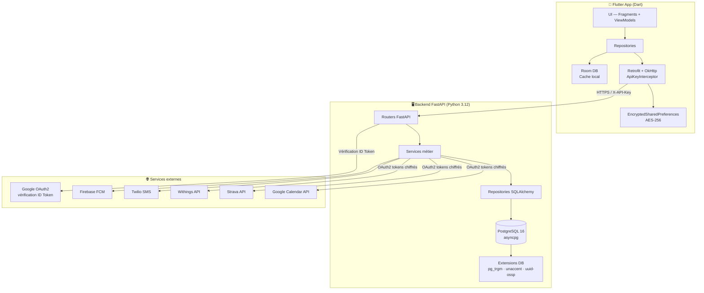

---

## 2. Convention d'authentification — toutes les requêtes

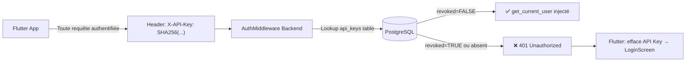

---

## 3. Onboarding Coach (wizard 7 étapes)

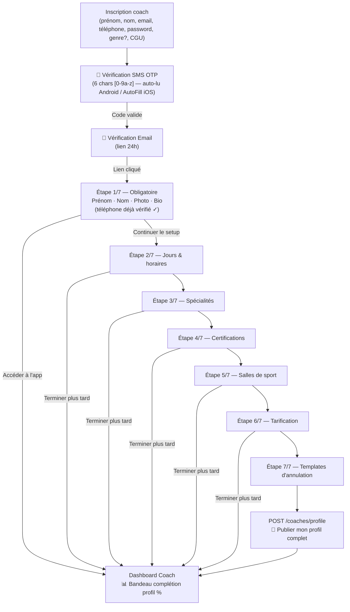

---

## 4. Onboarding Client (wizard 6 étapes)

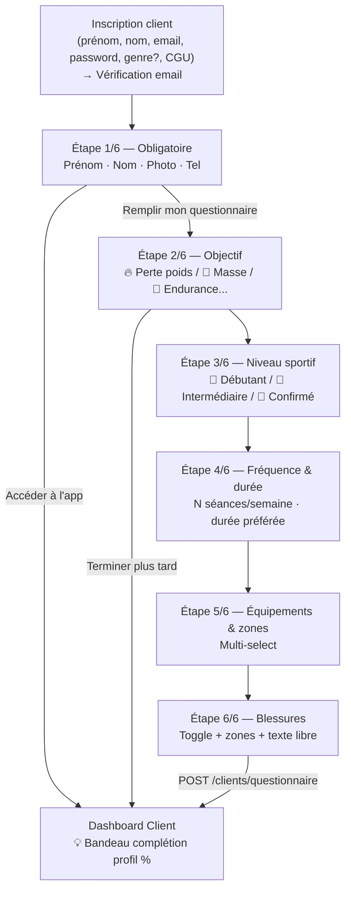

---

## 5. Cycle de vie d'une notification push

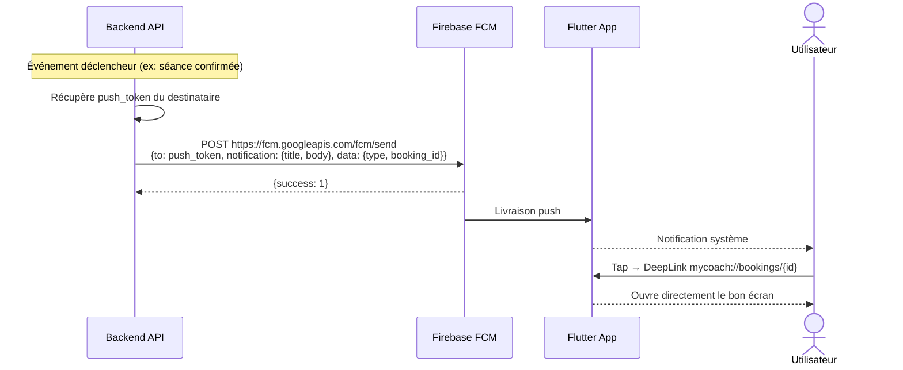

---

## 6. Flux SMS en masse

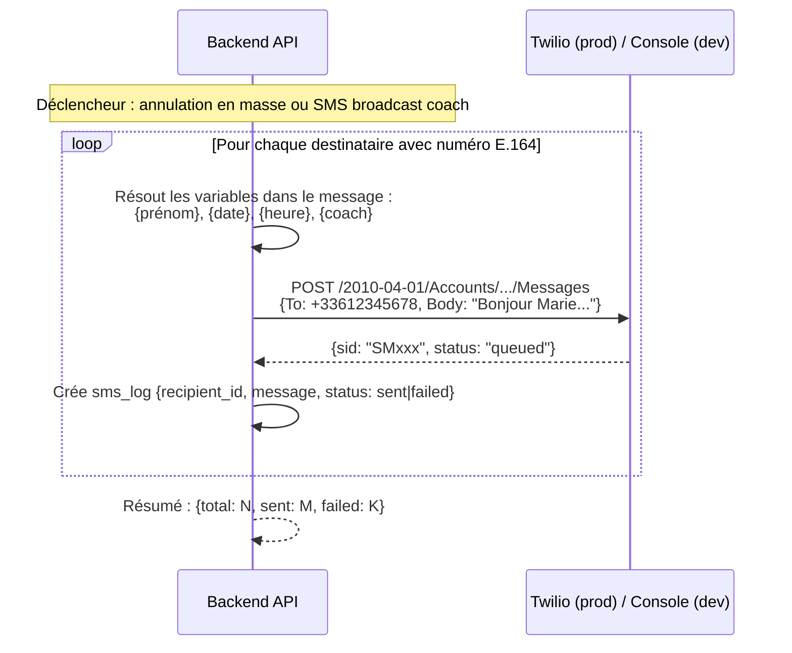

---

## 7. Catalogue des endpoints principaux

```mermaid
mindmap
  root(MyCoach API)
    Auth
      POST /auth/register
      POST /auth/login
      POST /auth/google
      GET /auth/me
      DELETE /auth/logout
      DELETE /auth/logout-all
      POST /auth/forgot-password
      POST /auth/reset-password
      GET /auth/verify-email
      POST /auth/verify-phone/request
      POST /auth/verify-phone/confirm
    Coaches
      GET|PATCH /coaches/me
      GET /coaches/search
      GET /coaches/{id}
      GET /coaches/{id}/availability
      GET|POST /coaches/me/packages
    Clients
      GET|PATCH /clients/me
      POST /clients/questionnaire
      GET /clients/{id}
    Gyms
      GET /gyms/search
      GET /users/me/gyms
      POST /users/me/gyms
      DELETE /users/me/gyms/{gym_id}
    Bookings
      POST /bookings
      GET /bookings
      PATCH /bookings/{id}/confirm
      PATCH /bookings/{id}/reject
      DELETE /bookings/{id}
      PATCH /bookings/{id}/done
      PATCH /bookings/{id}/no-show
      POST /bookings/bulk-cancel
      PATCH /bookings/{id}/waive-penalty
    Sessions
      POST|GET /sessions
      POST /sessions/{id}/waitlist
    Performances
      POST|GET /performances
      GET /performances/{id}
      PATCH /performances/{id}
      GET /performances/exercise/{id}/history
    Programs
      POST|GET /programs
      POST /programs/{id}/assign
      POST /programs/generate
    Payments
      POST /payments
      GET /payments/export
    Integrations
      GET /integrations/google-calendar/auth-url
      POST /integrations/google-calendar/callback
      GET /integrations/strava/auth-url
      POST /integrations/strava/callback
      POST /integrations/strava/push/{session_id}
      GET /integrations/withings/auth-url
      POST /integrations/withings/callback
    RGPD
      POST /users/me/export
      DELETE /users/me
      POST /consents
      GET /consents/me
```

---

## 8. Chiffrement des données sensibles (PII)

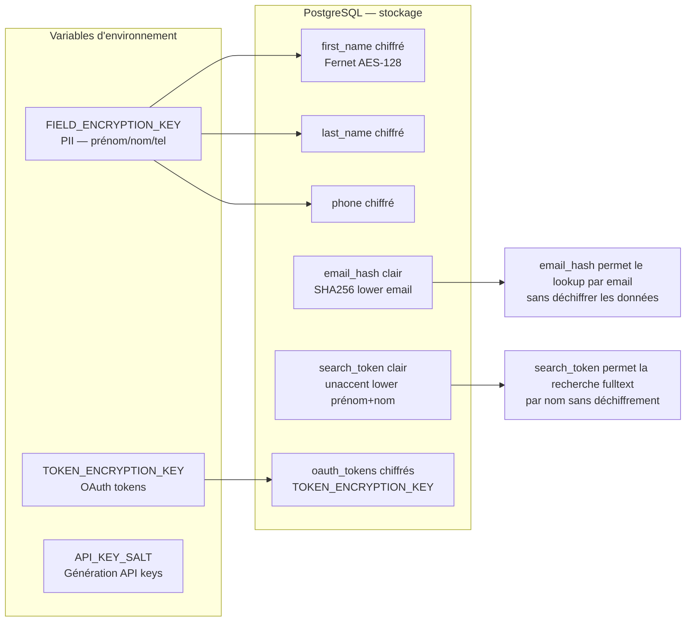


---

## 6. Architecture des rôles — Admin ⊇ Coach ⊇ Client

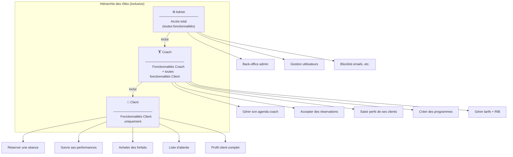

**Règles middleware :**

| Dépendance | Rôles autorisés | Cas d'usage |
|-----------|----------------|-------------|
| `require_client` | client, coach, admin | Réservation, performances, forfaits... |
| `require_coach` | coach, admin | Agenda coach, saisie perfs clients... |
| `require_admin` | admin uniquement | Back-office, configuration... |

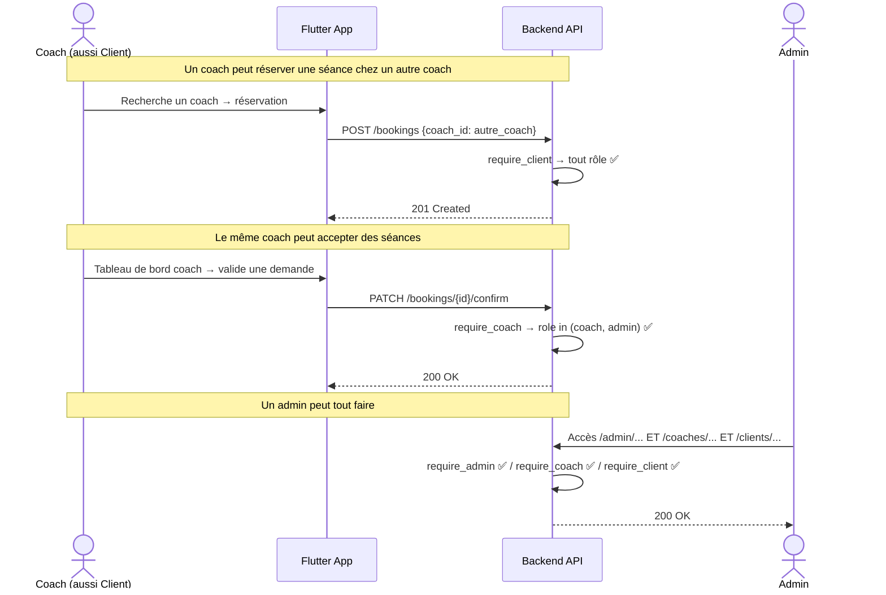

---

## 9. Découverte Coachs — Flux Salles & Recherche

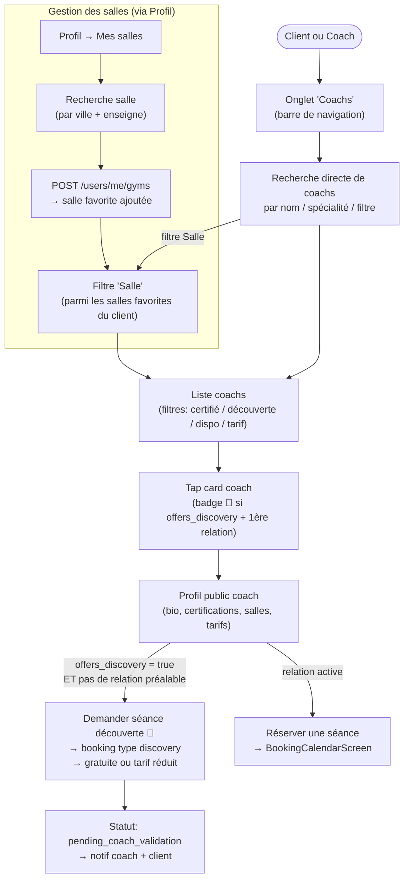

---

## 10. `offers_discovery` — Cycle de vie du badge découverte

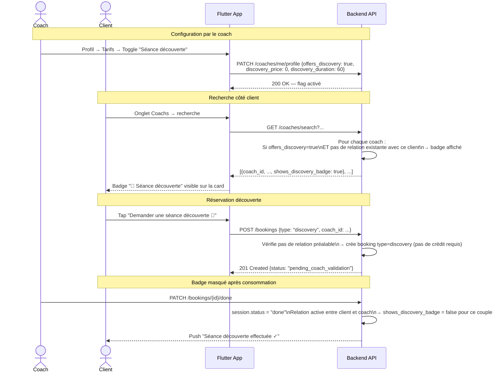
