# MyCoach — Architecture Globale & Flux Transverses

> Vue d'ensemble de l'architecture technique et des flux communs à toute l'application.

---

## 1. Architecture globale

```mermaid
flowchart TB
    subgraph Mobile ["📱 Android App (Kotlin)"]
        direction TB
        UI[UI — Fragments + ViewModels]
        REPO[Repositories]
        NET[Retrofit + OkHttp<br/>ApiKeyInterceptor]
        STORE[EncryptedSharedPreferences<br/>AES-256]
        ROOM[Room DB<br/>Cache local]

        UI --> REPO
        REPO --> NET
        REPO --> ROOM
        NET --> STORE
    end

    subgraph Backend ["🖥️ Backend FastAPI (Python 3.12)"]
        direction TB
        ROUTER[Routers FastAPI]
        SERVICE[Services métier]
        REPO_B[Repositories SQLAlchemy]
        DB[(PostgreSQL 16<br/>asyncpg)]
        CACHE[Extensions DB<br/>pg_trgm · unaccent · uuid-ossp]

        ROUTER --> SERVICE
        SERVICE --> REPO_B
        REPO_B --> DB
        DB --> CACHE
    end

    subgraph External ["🌐 Services externes"]
        GC[Google Calendar API]
        STR[Strava API]
        WITH[Withings API]
        GAUTH[Google OAuth2<br/>vérification ID Token]
        SMS[Twilio SMS]
        PUSH[Firebase FCM]
    end

    NET -->|HTTPS / X-API-Key| ROUTER
    SERVICE -->|OAuth2 tokens chiffrés| GC
    SERVICE -->|OAuth2 tokens chiffrés| STR
    SERVICE -->|OAuth2 tokens chiffrés| WITH
    ROUTER -->|Vérification ID Token| GAUTH
    SERVICE --> SMS
    SERVICE --> PUSH
```



---

## 2. Convention d'authentification — toutes les requêtes

```mermaid
flowchart LR
    A[Android App] -->|Toute requête authentifiée| H["Header: X-API-Key: SHA256(...)"]
    H --> MW[AuthMiddleware Backend]
    MW -->|Lookup api_keys table| DB[(PostgreSQL)]
    DB -->|revoked=FALSE| OK[✅ get_current_user injecté]
    DB -->|revoked=TRUE ou absent| ERR[❌ 401 Unauthorized]
    ERR --> APP[Android: efface API Key → LoginScreen]
```



---

## 3. Onboarding Coach (wizard 7 étapes)

```mermaid
flowchart TD
    REG[Inscription + Vérification email] --> E1

    E1["Étape 1/7 — Obligatoire\nPrénom · Nom · Photo · Tel · Bio"] -->|Accéder à l'app| DASH
    E1 -->|Continuer le setup| E2

    E2["Étape 2/7 — Jours & horaires"] -->|Terminer plus tard| DASH
    E2 --> E3

    E3["Étape 3/7 — Spécialités"] -->|Terminer plus tard| DASH
    E3 --> E4

    E4["Étape 4/7 — Certifications"] -->|Terminer plus tard| DASH
    E4 --> E5

    E5["Étape 5/7 — Salles de sport"] -->|Terminer plus tard| DASH
    E5 --> E6

    E6["Étape 6/7 — Tarification"] -->|Terminer plus tard| DASH
    E6 --> E7

    E7["Étape 7/7 — Templates d'annulation"] --> PUB
    PUB["POST /coaches/profile\n🚀 Publier mon profil complet"] --> DASH

    DASH[Dashboard Coach\n📊 Bandeau complétion profil %]
```



---

## 4. Onboarding Client (wizard 6 étapes)

```mermaid
flowchart TD
    REG[Inscription + Vérification email] --> E1

    E1["Étape 1/6 — Obligatoire\nPrénom · Nom · Photo · Tel"] -->|Accéder à l'app| DASH
    E1 -->|Remplir mon questionnaire| E2

    E2["Étape 2/6 — Objectif\n🔥 Perte poids / 💪 Masse / 🏃 Endurance..."] -->|Terminer plus tard| DASH
    E2 --> E3

    E3["Étape 3/6 — Niveau sportif\n🌱 Débutant / 🌿 Intermédiaire / 🌳 Confirmé"] --> E4
    E4["Étape 4/6 — Fréquence & durée\nN séances/semaine · durée préférée"] --> E5
    E5["Étape 5/6 — Équipements & zones\nMulti-select"] --> E6
    E6["Étape 6/6 — Blessures\nToggle + zones + texte libre"] -->|POST /clients/questionnaire| DASH

    DASH[Dashboard Client\n💡 Bandeau complétion profil %]
```



---

## 5. Cycle de vie d'une notification push

```mermaid
sequenceDiagram
    participant B as Backend API
    participant FCM as Firebase FCM
    participant A as Android App
    actor U as Utilisateur

    note over B: Événement déclencheur (ex: séance confirmée)
    B->>B: Récupère push_token du destinataire
    B->>FCM: POST https://fcm.googleapis.com/fcm/send<br/>{to: push_token, notification: {title, body}, data: {type, booking_id}}
    FCM-->>B: {success: 1}
    FCM->>A: Livraison push
    A-->>U: Notification système
    U->>A: Tap → DeepLink mycoach://bookings/{id}
    A-->>U: Ouvre directement le bon écran
```



---

## 6. Flux SMS en masse

```mermaid
sequenceDiagram
    participant B as Backend API
    participant SMS as Twilio (prod) / Console (dev)

    note over B: Déclencheur : annulation en masse ou SMS broadcast coach

    loop Pour chaque destinataire avec numéro E.164
        B->>B: Résout les variables dans le message :<br/>{prénom}, {date}, {heure}, {coach}
        B->>SMS: POST /2010-04-01/Accounts/.../Messages<br/>{To: +33612345678, Body: "Bonjour Marie..."}
        SMS-->>B: {sid: "SMxxx", status: "queued"}
        B->>B: Crée sms_log {recipient_id, message, status: sent|failed}
    end

    B-->>B: Résumé : {total: N, sent: M, failed: K}
```



---

## 7. Catalogue des endpoints principaux

```mermaid
mindmap
  root(MyCoach API)
    Auth
      POST /auth/register
      POST /auth/login
      POST /auth/google
      GET /auth/me
      DELETE /auth/logout
      DELETE /auth/logout-all
      POST /auth/forgot-password
      POST /auth/reset-password
      GET /auth/verify-email
    Coaches
      GET|PATCH /coaches/me
      GET /coaches/search
      GET /coaches/{id}
      GET /coaches/{id}/availability
      GET|POST /coaches/me/packages
    Clients
      GET|PATCH /clients/me
      POST /clients/questionnaire
      GET /clients/{id}
    Bookings
      POST /bookings
      GET /bookings
      PATCH /bookings/{id}/confirm
      PATCH /bookings/{id}/reject
      DELETE /bookings/{id}
      PATCH /bookings/{id}/done
      PATCH /bookings/{id}/no-show
      POST /bookings/bulk-cancel
      PATCH /bookings/{id}/waive-penalty
    Sessions
      POST|GET /sessions
      POST /sessions/{id}/waitlist
    Performances
      POST|GET /performances
      GET /performances/{id}
      PATCH /performances/{id}
      GET /performances/exercise/{id}/history
    Programs
      POST|GET /programs
      POST /programs/{id}/assign
      POST /programs/generate
    Payments
      POST /payments
      GET /payments/export
    Integrations
      GET /integrations/google-calendar/auth-url
      POST /integrations/google-calendar/callback
      GET /integrations/strava/auth-url
      POST /integrations/strava/callback
      POST /integrations/strava/push/{session_id}
      GET /integrations/withings/auth-url
      POST /integrations/withings/callback
    RGPD
      POST /users/me/export
      DELETE /users/me
      POST /consents
      GET /consents/me
```

---

## 8. Chiffrement des données sensibles (PII)

```mermaid
flowchart LR
    subgraph DB ["PostgreSQL — stockage"]
        F1[first_name chiffré\nFernet AES-128]
        F2[last_name chiffré]
        F3[phone chiffré]
        F4[email_hash clair\nSHA256 lower email]
        F5[search_token clair\nunaccent lower prénom+nom]
        F6[oauth_tokens chiffrés\nTOKEN_ENCRYPTION_KEY]
    end

    subgraph Keys ["Variables d'environnement"]
        K1[FIELD_ENCRYPTION_KEY\nPII — prénom/nom/tel]
        K2[TOKEN_ENCRYPTION_KEY\nOAuth tokens]
        K3[API_KEY_SALT\nGénération API keys]
    end

    K1 --> F1 & F2 & F3
    K2 --> F6

    note1[email_hash permet le lookup par email\nsans déchiffrer les données]
    note2[search_token permet la recherche fulltext\npar nom sans déchiffrement]
    F4 --> note1
    F5 --> note2
```




---

## 6. Architecture des rôles — Admin ⊇ Coach ⊇ Client

```mermaid
flowchart TD
    subgraph ROLES["Hiérarchie des rôles (inclusive)"]
        ADMIN["⚙️ Admin
        ─────────────────
        Accès total
        (toutes fonctionnalités)"]

        COACH["🏋️ Coach
        ─────────────────
        Fonctionnalités Coach
        + toutes fonctionnalités Client"]

        CLIENT["👤 Client
        ─────────────────
        Fonctionnalités Client uniquement"]
    end

    ADMIN -->|"inclut"| COACH
    COACH -->|"inclut"| CLIENT

    CLIENT --> F1["Réserver une séance"]
    CLIENT --> F2["Suivre ses performances"]
    CLIENT --> F3["Acheter des forfaits"]
    CLIENT --> F4["Liste d'attente"]
    CLIENT --> F5["Profil client complet"]

    COACH --> F6["Gérer son agenda coach"]
    COACH --> F7["Accepter des réservations"]
    COACH --> F8["Saisir perfs de ses clients"]
    COACH --> F9["Créer des programmes"]
    COACH --> F10["Gérer tarifs + RIB"]

    ADMIN --> F11["Back-office admin"]
    ADMIN --> F12["Gestion utilisateurs"]
    ADMIN --> F13["Blocklist emails, etc."]
```



**Règles middleware :**

| Dépendance | Rôles autorisés | Cas d'usage |
|-----------|----------------|-------------|
| `require_client` | client, coach, admin | Réservation, performances, forfaits... |
| `require_coach` | coach, admin | Agenda coach, saisie perfs clients... |
| `require_admin` | admin uniquement | Back-office, configuration... |

```mermaid
sequenceDiagram
    actor K as Coach (aussi Client)
    participant A as Android App
    participant B as Backend API

    note over K,B: Un coach peut réserver une séance chez un autre coach
    K->>A: Recherche un coach → réservation
    A->>B: POST /bookings {coach_id: autre_coach}
    B->>B: require_client → tout rôle ✅
    B-->>A: 201 Created

    note over K,B: Le même coach peut accepter des séances
    K->>A: Tableau de bord coach → valide une demande
    A->>B: PATCH /bookings/{id}/confirm
    B->>B: require_coach → role in (coach, admin) ✅
    B-->>A: 200 OK

    note over K,B: Un admin peut tout faire
    actor ADM as Admin
    ADM->>B: Accès /admin/... ET /coaches/... ET /clients/...
    B->>B: require_admin ✅ / require_coach ✅ / require_client ✅
    B-->>ADM: 200 OK
```


