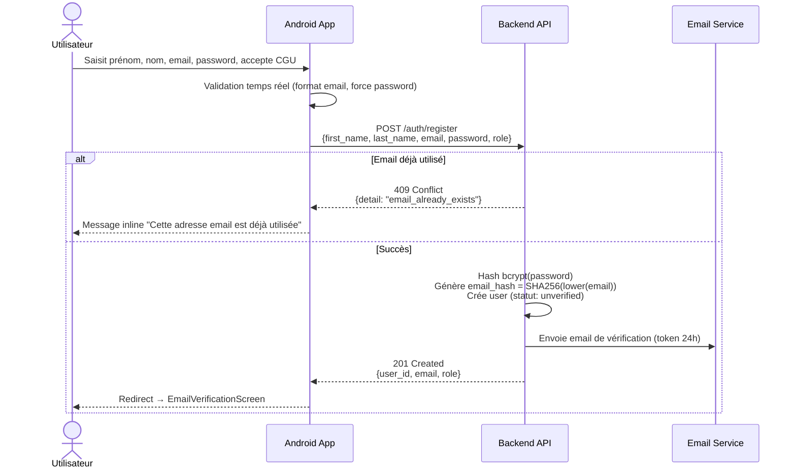
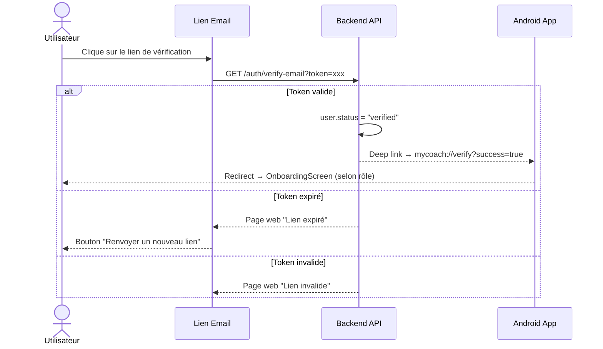
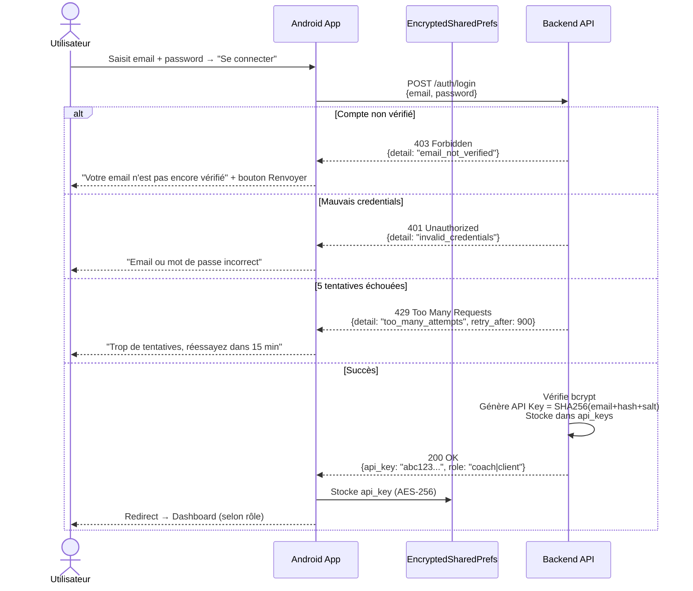
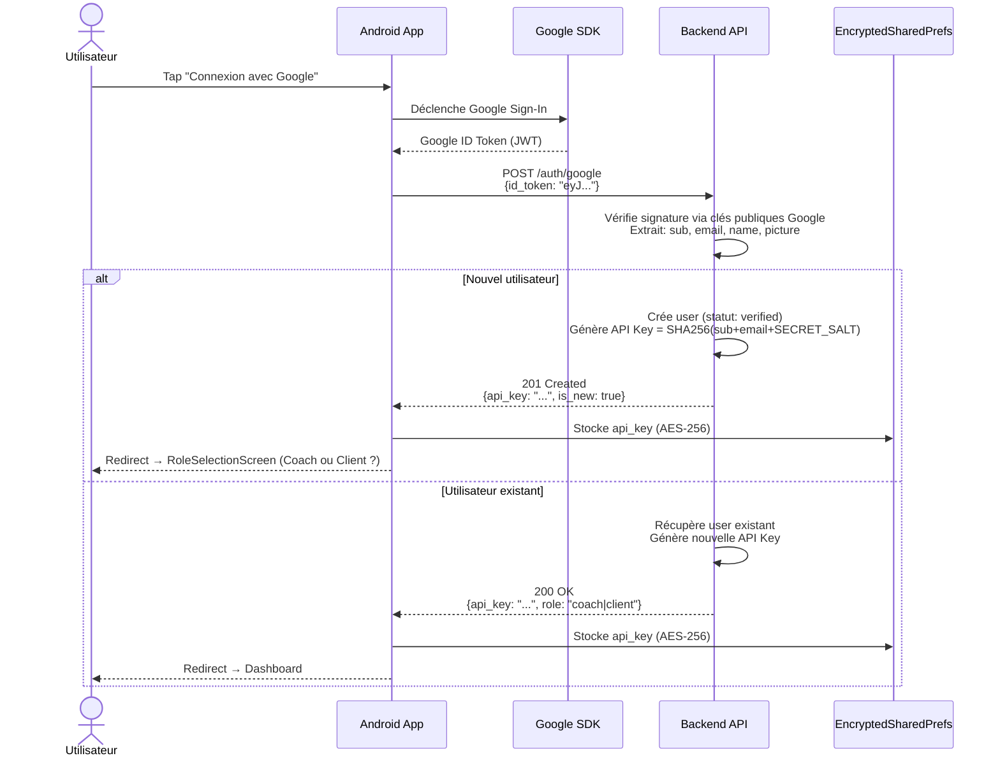
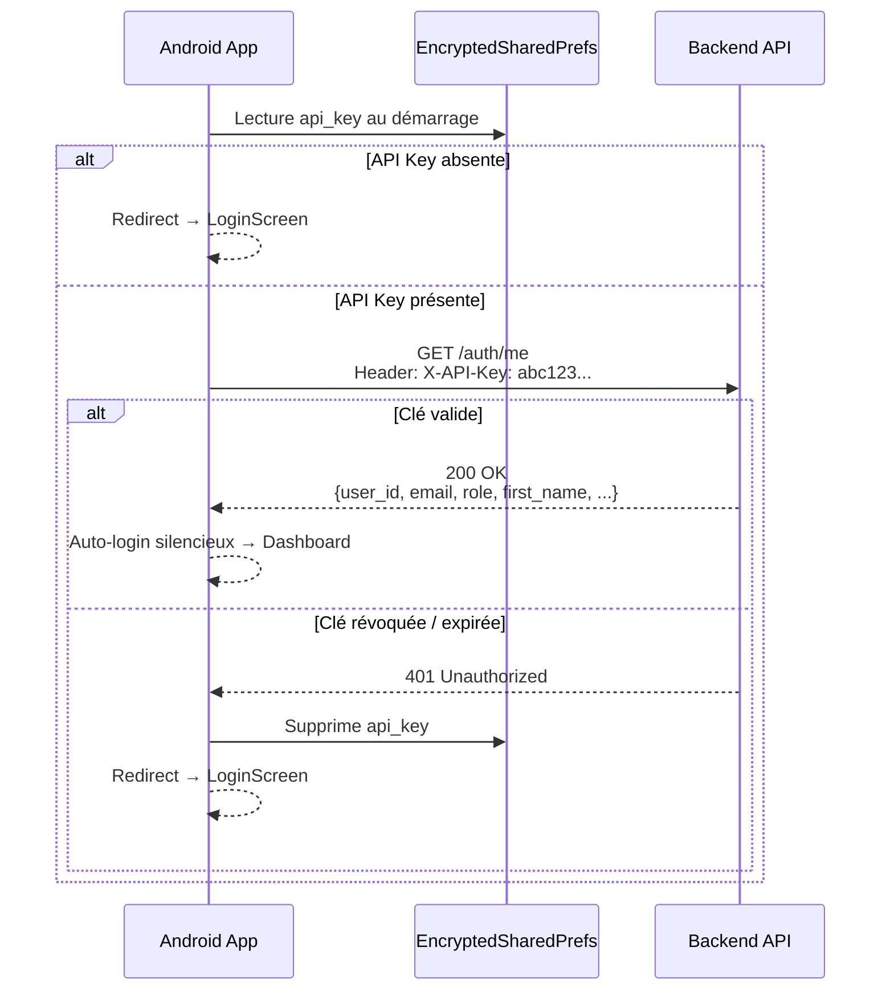
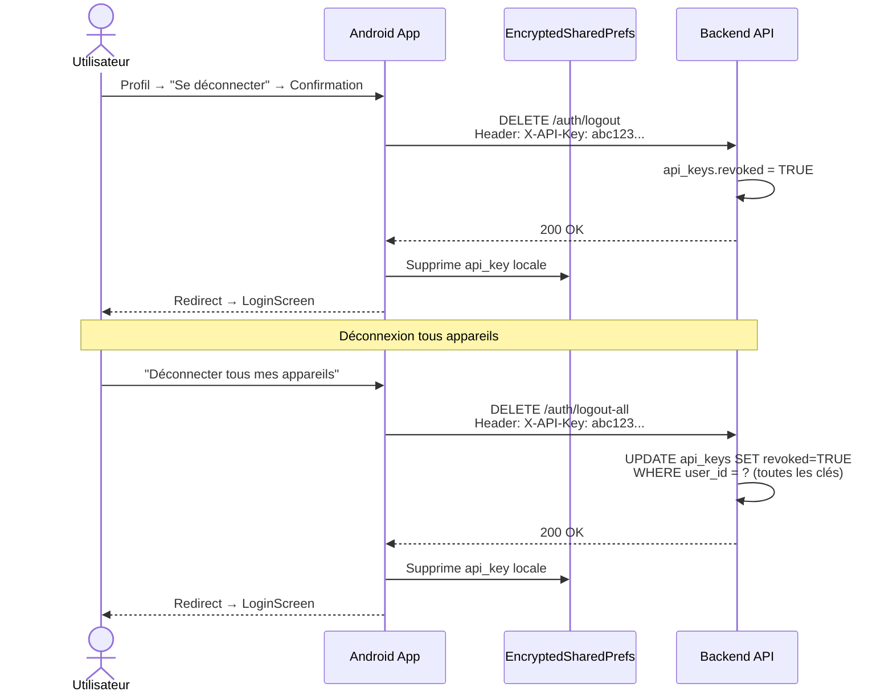
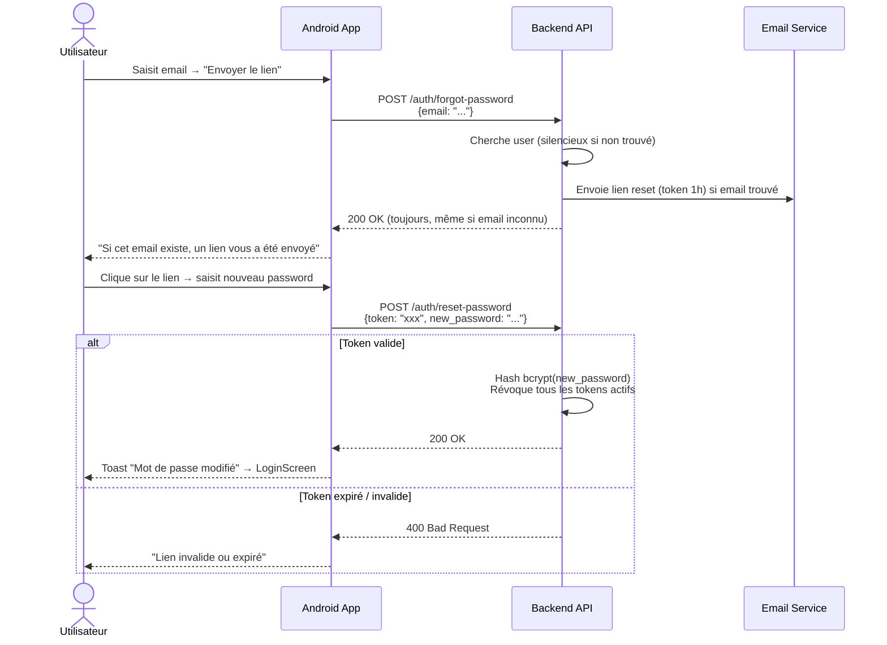
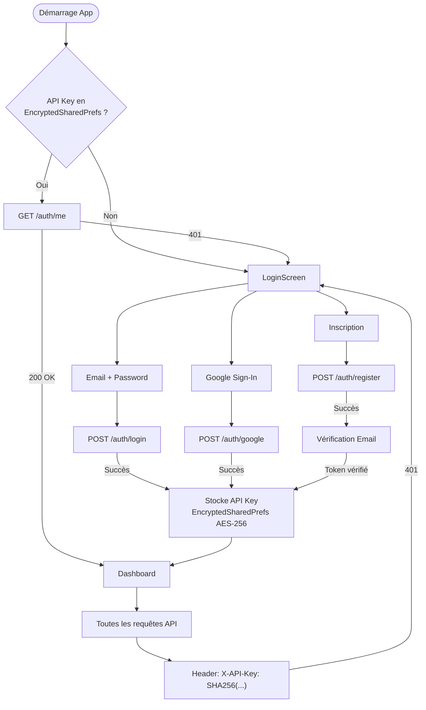

# MyCoach — Flux Authentification

> Flux technico-fonctionnels entre l'application Android et le backend FastAPI.

---

## 1. Inscription (Email)

---

## 2. Vérification Email

---

## 3. Connexion (Email + Password)

---

## 4. Connexion Google (OAuth2)

---

## 5. Auto-login au démarrage

---

## 6. Déconnexion

---

## 7. Réinitialisation du mot de passe

---

## 8. Schéma général de l'authentification

