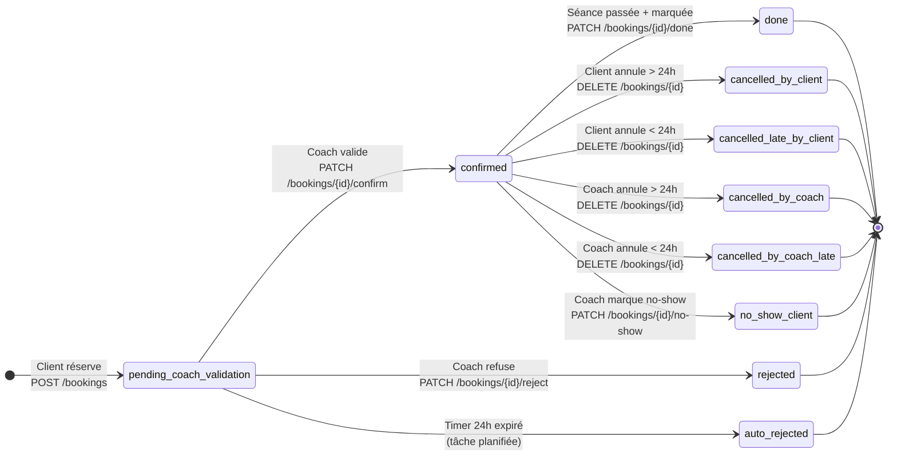
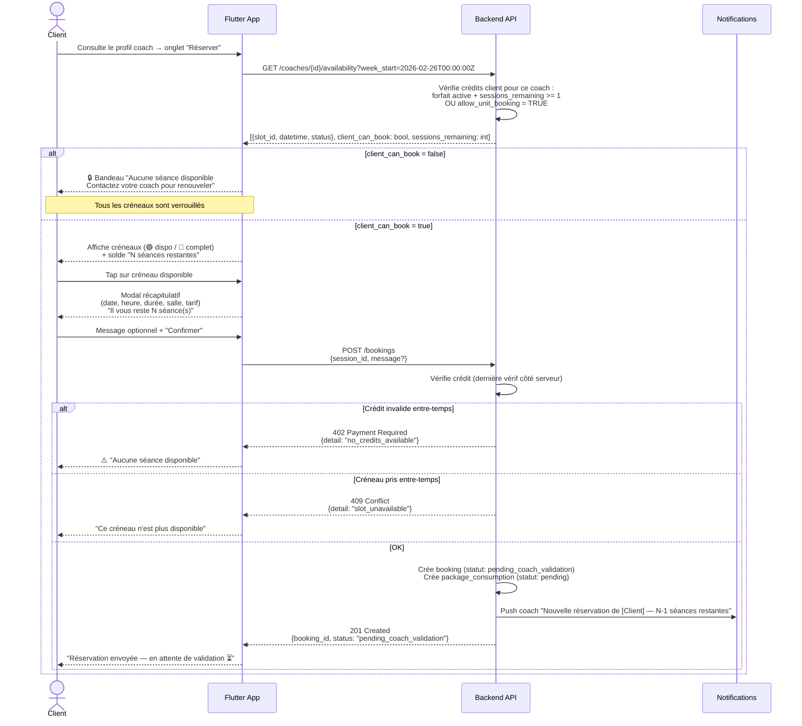
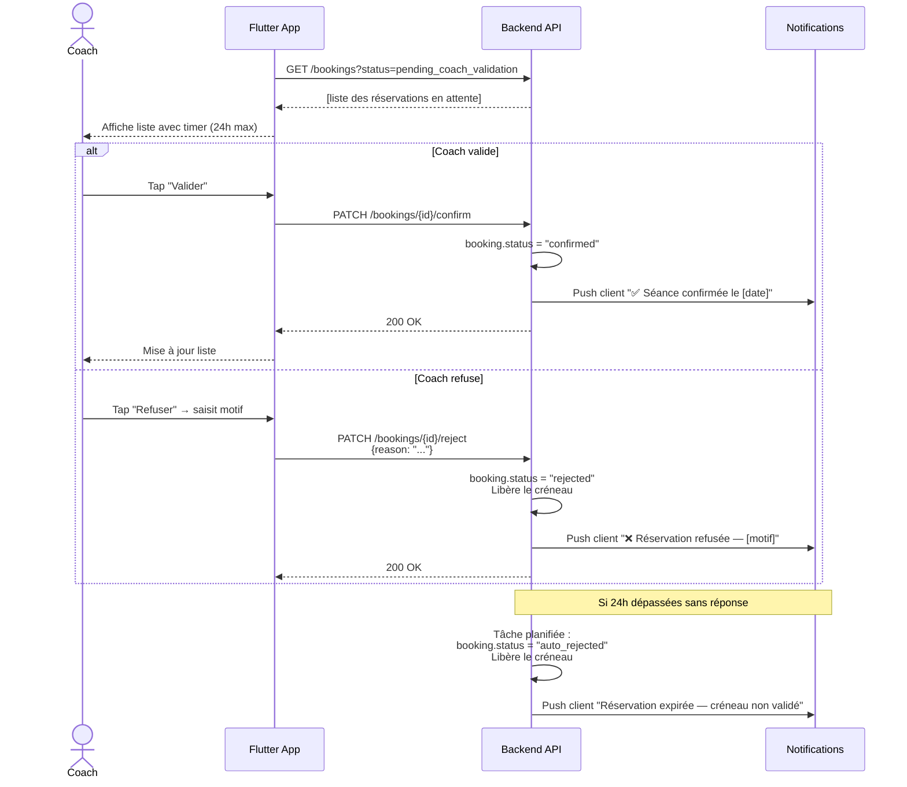
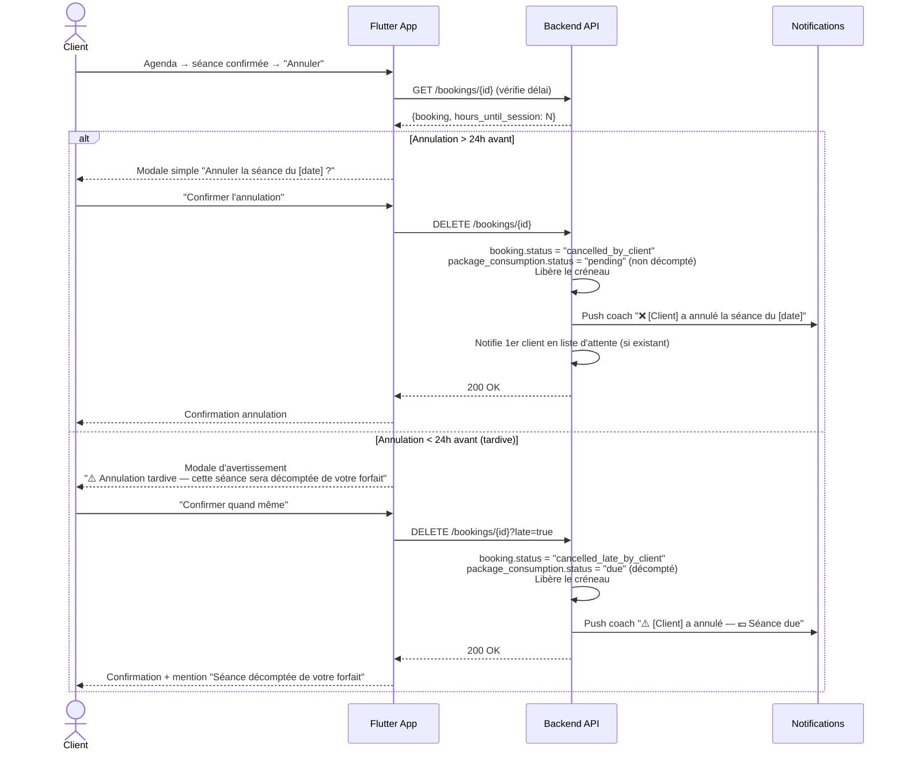
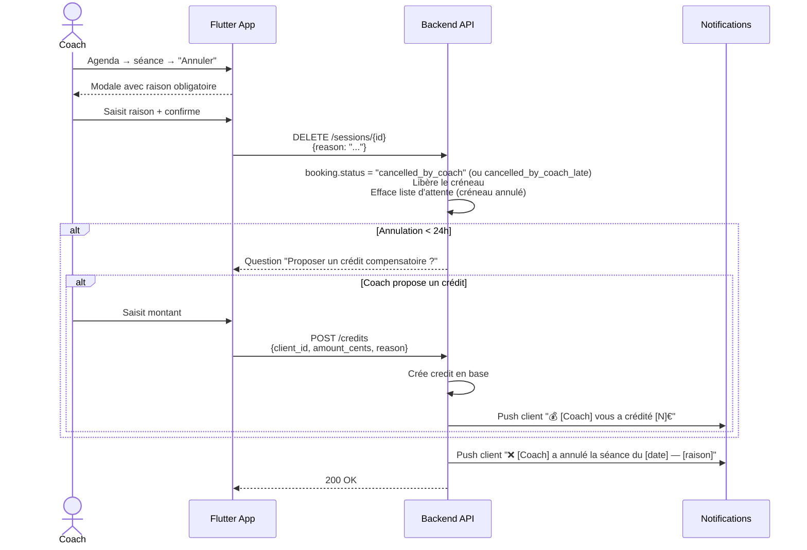
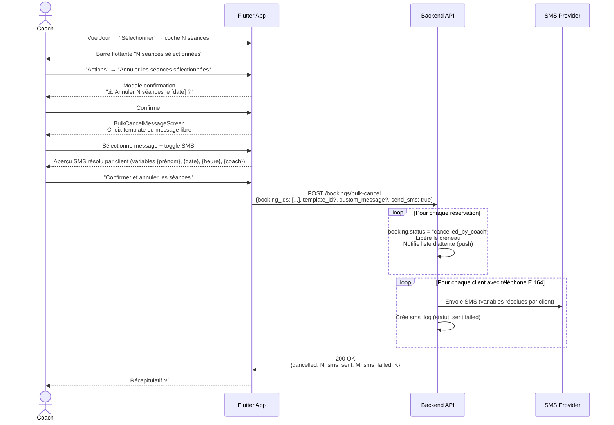
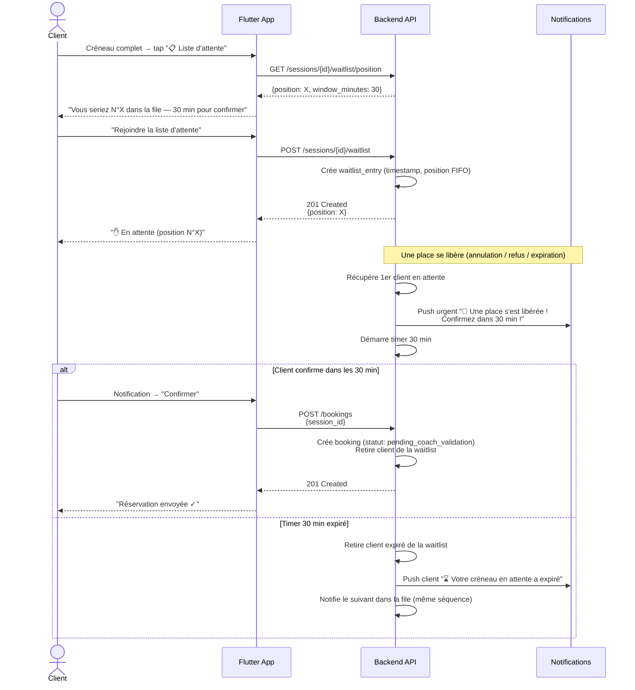
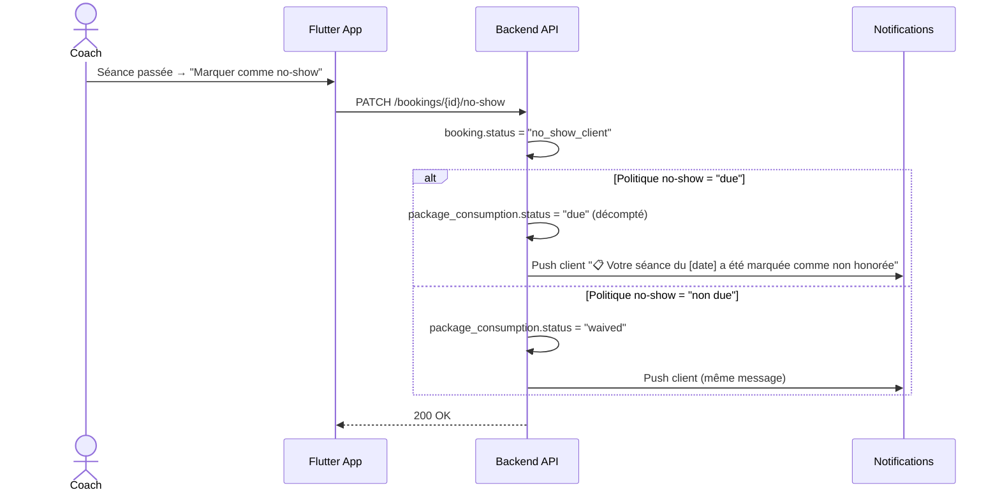

# MyCoach — Flux Réservation & Machine d'État

> Flux technico-fonctionnels entre l'application Android et le backend FastAPI.

---

## 1. Machine d'état d'une réservation

---

## 2. Réservation par le client

---

## 3. Validation / Refus par le coach

---

## 4. Annulation par le client

---

## 5. Annulation par le coach (unitaire)

---

## 6. Annulation en masse (coach)

---

## 7. Liste d'attente

---

## 8. No-show client

