# MyCoach — Flux Réservation & Machine d'État

> Flux technico-fonctionnels entre l'application Android et le backend FastAPI.

---

## 1. Machine d'état d'une réservation

```mermaid
stateDiagram-v2
    direction LR

    [*] --> pending_coach_validation : Client réserve<br/>POST /bookings

    pending_coach_validation --> confirmed : Coach valide<br/>PATCH /bookings/{id}/confirm
    pending_coach_validation --> rejected : Coach refuse<br/>PATCH /bookings/{id}/reject
    pending_coach_validation --> auto_rejected : Timer 24h expiré<br/>(tâche planifiée)

    confirmed --> done : Séance passée + marquée<br/>PATCH /bookings/{id}/done
    confirmed --> cancelled_by_client : Client annule > 24h<br/>DELETE /bookings/{id}
    confirmed --> cancelled_late_by_client : Client annule < 24h<br/>DELETE /bookings/{id}
    confirmed --> cancelled_by_coach : Coach annule > 24h<br/>DELETE /bookings/{id}
    confirmed --> cancelled_by_coach_late : Coach annule < 24h<br/>DELETE /bookings/{id}
    confirmed --> no_show_client : Coach marque no-show<br/>PATCH /bookings/{id}/no-show

    done --> [*]
    rejected --> [*]
    auto_rejected --> [*]
    cancelled_by_client --> [*]
    cancelled_late_by_client --> [*]
    cancelled_by_coach --> [*]
    cancelled_by_coach_late --> [*]
    no_show_client --> [*]
```

---

## 2. Réservation par le client

```mermaid
sequenceDiagram
    actor C as Client
    participant A as Flutter App
    participant B as Backend API
    participant N as Notifications

    C->>A: Consulte le profil coach → onglet "Réserver"
    A->>B: GET /coaches/{id}/availability?week_start=2026-02-26T00:00:00Z
    B->>B: Vérifie crédits client pour ce coach :<br/>forfait active + sessions_remaining >= 1<br/>OU allow_unit_booking = TRUE
    B-->>A: [{slot_id, datetime, status}, client_can_book: bool, sessions_remaining: int]

    alt client_can_book = false
        A-->>C: 🔒 Bandeau "Aucune séance disponible<br/>Contactez votre coach pour renouveler"
        note over C,A: Tous les créneaux sont verrouillés
    else client_can_book = true
        A-->>C: Affiche créneaux (🟢 dispo / 🔴 complet)<br/>+ solde "N séances restantes"

        C->>A: Tap sur créneau disponible
        A-->>C: Modal récapitulatif<br/>(date, heure, durée, salle, tarif)<br/>"Il vous reste N séance(s)"
        C->>A: Message optionnel + "Confirmer"
        A->>B: POST /bookings<br/>{session_id, message?}

        B->>B: Vérifie crédit (dernière vérif côté serveur)
        alt Crédit invalide entre-temps
            B-->>A: 402 Payment Required<br/>{detail: "no_credits_available"}
            A-->>C: ⚠️ "Aucune séance disponible"
        else Créneau pris entre-temps
            B-->>A: 409 Conflict<br/>{detail: "slot_unavailable"}
            A-->>C: "Ce créneau n'est plus disponible"
        else OK
            B->>B: Crée booking (statut: pending_coach_validation)<br/>Crée package_consumption (statut: pending)
            B->>N: Push coach "Nouvelle réservation de [Client] — N-1 séances restantes"
            B-->>A: 201 Created<br/>{booking_id, status: "pending_coach_validation"}
            A-->>C: "Réservation envoyée — en attente de validation ⏳"
        end
    end
```

---

## 3. Validation / Refus par le coach

```mermaid
sequenceDiagram
    actor K as Coach
    participant A as Flutter App
    participant B as Backend API
    participant N as Notifications

    A->>B: GET /bookings?status=pending_coach_validation
    B-->>A: [liste des réservations en attente]
    A-->>K: Affiche liste avec timer (24h max)

    alt Coach valide
        K->>A: Tap "Valider"
        A->>B: PATCH /bookings/{id}/confirm
        B->>B: booking.status = "confirmed"
        B->>N: Push client "✅ Séance confirmée le [date]"
        B-->>A: 200 OK
        A-->>K: Mise à jour liste
    else Coach refuse
        K->>A: Tap "Refuser" → saisit motif
        A->>B: PATCH /bookings/{id}/reject<br/>{reason: "..."}
        B->>B: booking.status = "rejected"<br/>Libère le créneau
        B->>N: Push client "❌ Réservation refusée — [motif]"
        B-->>A: 200 OK
    end

    note over B,N: Si 24h dépassées sans réponse
    B->>B: Tâche planifiée :<br/>booking.status = "auto_rejected"<br/>Libère le créneau
    B->>N: Push client "Réservation expirée — créneau non validé"
```

---

## 4. Annulation par le client

```mermaid
sequenceDiagram
    actor C as Client
    participant A as Flutter App
    participant B as Backend API
    participant N as Notifications

    C->>A: Agenda → séance confirmée → "Annuler"
    A->>B: GET /bookings/{id} (vérifie délai)
    B-->>A: {booking, hours_until_session: N}

    alt Annulation > 24h avant
        A-->>C: Modale simple "Annuler la séance du [date] ?"
        C->>A: "Confirmer l'annulation"
        A->>B: DELETE /bookings/{id}
        B->>B: booking.status = "cancelled_by_client"<br/>package_consumption.status = "pending" (non décompté)<br/>Libère le créneau
        B->>N: Push coach "❌ [Client] a annulé la séance du [date]"
        B->>B: Notifie 1er client en liste d'attente (si existant)
        B-->>A: 200 OK
        A-->>C: Confirmation annulation
    else Annulation < 24h avant (tardive)
        A-->>C: Modale d'avertissement<br/>"⚠️ Annulation tardive — cette séance sera décomptée de votre forfait"
        C->>A: "Confirmer quand même"
        A->>B: DELETE /bookings/{id}?late=true
        B->>B: booking.status = "cancelled_late_by_client"<br/>package_consumption.status = "due" (décompté)<br/>Libère le créneau
        B->>N: Push coach "⚠️ [Client] a annulé — 💶 Séance due"
        B-->>A: 200 OK
        A-->>C: Confirmation + mention "Séance décomptée de votre forfait"
    end
```

---

## 5. Annulation par le coach (unitaire)

```mermaid
sequenceDiagram
    actor K as Coach
    participant A as Flutter App
    participant B as Backend API
    participant N as Notifications

    K->>A: Agenda → séance → "Annuler"
    A-->>K: Modale avec raison obligatoire
    K->>A: Saisit raison + confirme
    A->>B: DELETE /sessions/{id}<br/>{reason: "..."}

    B->>B: booking.status = "cancelled_by_coach" (ou cancelled_by_coach_late)<br/>Libère le créneau<br/>Efface liste d'attente (créneau annulé)

    alt Annulation < 24h
        B-->>A: Question "Proposer un crédit compensatoire ?"
        alt Coach propose un crédit
            K->>A: Saisit montant
            A->>B: POST /credits<br/>{client_id, amount_cents, reason}
            B->>B: Crée credit en base
            B->>N: Push client "💰 [Coach] vous a crédité [N]€"
        end
    end

    B->>N: Push client "❌ [Coach] a annulé la séance du [date] — [raison]"
    B-->>A: 200 OK
```

---

## 6. Annulation en masse (coach)

```mermaid
sequenceDiagram
    actor K as Coach
    participant A as Flutter App
    participant B as Backend API
    participant S as SMS Provider

    K->>A: Vue Jour → "Sélectionner" → coche N séances
    A-->>K: Barre flottante "N séances sélectionnées"
    K->>A: "Actions" → "Annuler les séances sélectionnées"
    A-->>K: Modale confirmation<br/>"⚠️ Annuler N séances le [date] ?"
    K->>A: Confirme

    A-->>K: BulkCancelMessageScreen<br/>Choix template ou message libre
    K->>A: Sélectionne message + toggle SMS

    A-->>K: Aperçu SMS résolu par client (variables {prénom}, {date}, {heure}, {coach})
    K->>A: "Confirmer et annuler les séances"

    A->>B: POST /bookings/bulk-cancel<br/>{booking_ids: [...], template_id?, custom_message?, send_sms: true}

    loop Pour chaque réservation
        B->>B: booking.status = "cancelled_by_coach"<br/>Libère le créneau<br/>Notifie liste d'attente (push)
    end

    loop Pour chaque client avec téléphone E.164
        B->>S: Envoie SMS (variables résolues par client)
        B->>B: Crée sms_log (statut: sent|failed)
    end

    B-->>A: 200 OK<br/>{cancelled: N, sms_sent: M, sms_failed: K}
    A-->>K: Récapitulatif ✅
```

---

## 7. Liste d'attente

---

## 8. No-show client

```mermaid
sequenceDiagram
    actor K as Coach
    participant A as Flutter App
    participant B as Backend API
    participant N as Notifications

    K->>A: Séance passée → "Marquer comme no-show"
    A->>B: PATCH /bookings/{id}/no-show
    B->>B: booking.status = "no_show_client"
    alt Politique no-show = "due"
        B->>B: package_consumption.status = "due" (décompté)
        B->>N: Push client "📋 Votre séance du [date] a été marquée comme non honorée"
    else Politique no-show = "non due"
        B->>B: package_consumption.status = "waived"
        B->>N: Push client (même message)
    end
    B-->>A: 200 OK
```

