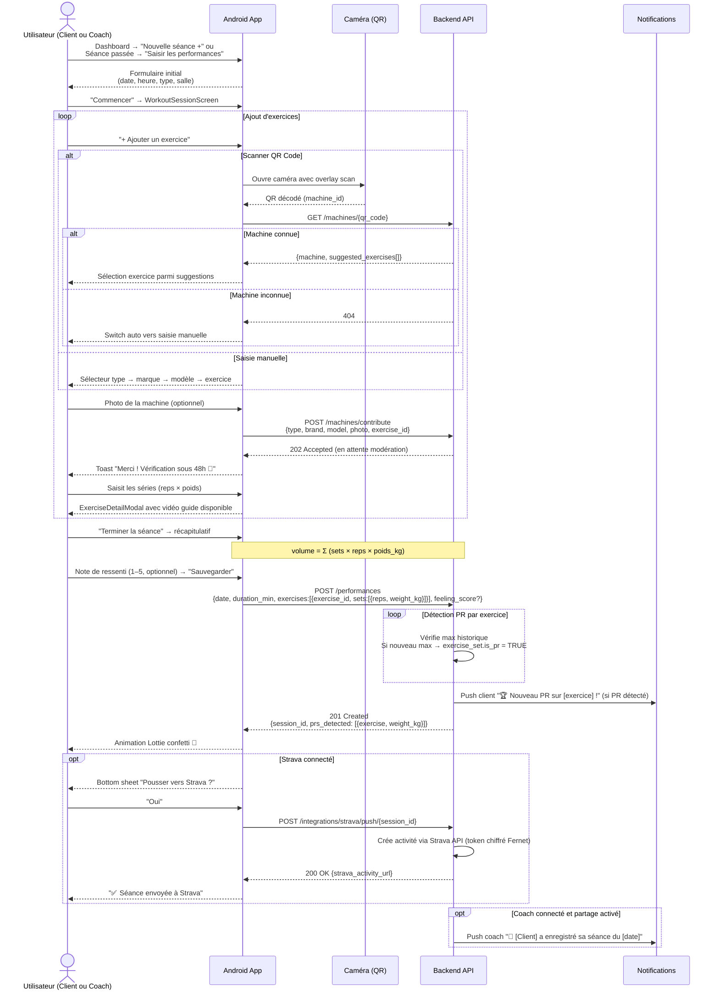
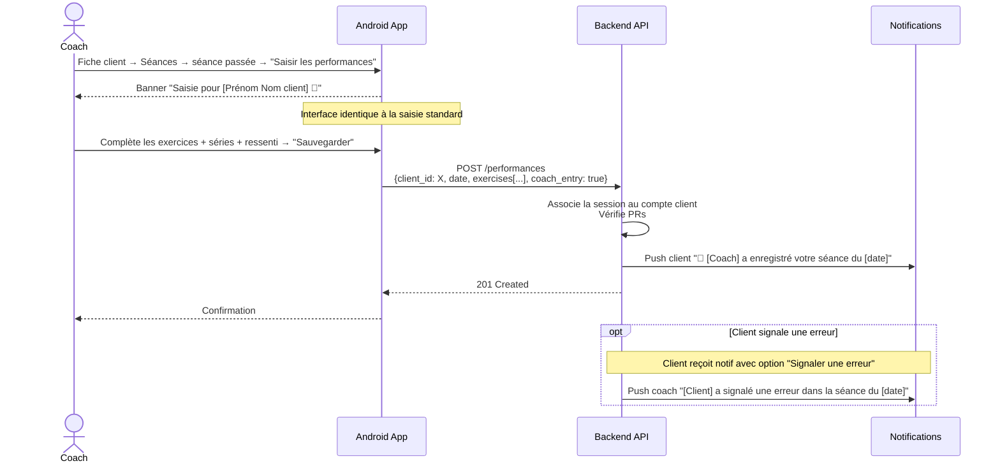
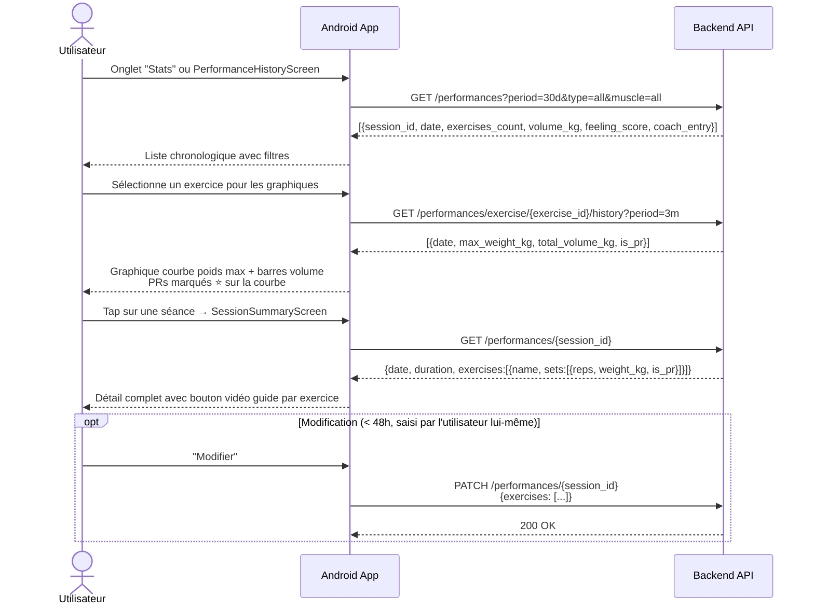
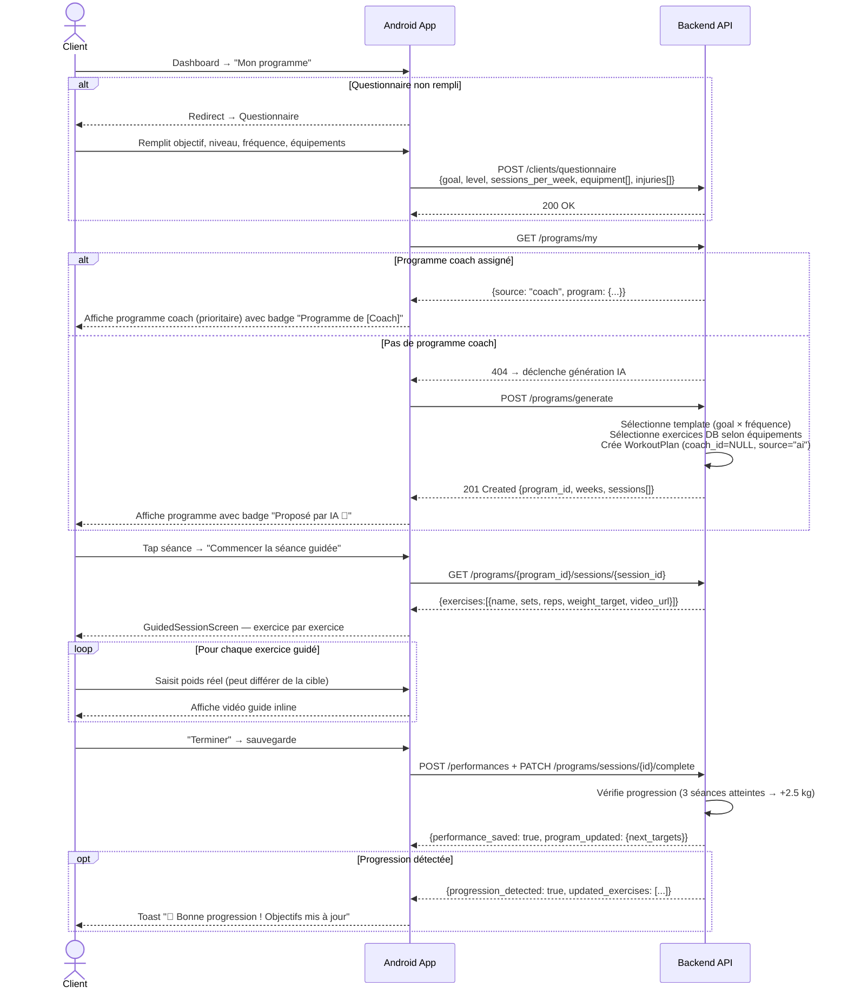
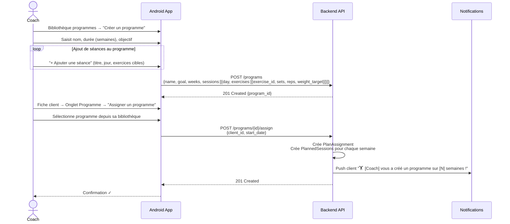
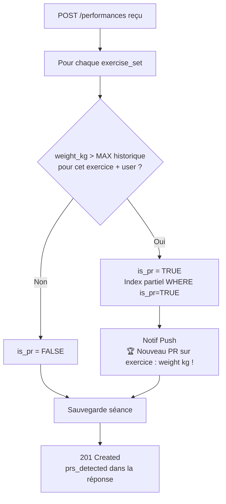

# MyCoach — Flux Performances & Programmes

> Flux technico-fonctionnels entre l'application Android et le backend FastAPI.

---

## 1. Saisie d'une séance de performance

---

## 2. Saisie par le coach pour un client

---

## 3. Consultation de l'historique et des graphiques

---

## 4. Programme IA — Génération et suivi

---

## 5. Programme coach — Assignation à un client

---

## 6. Détection des records personnels (PRs)

