# MyCoach — Flux Performances & Programmes

> Flux technico-fonctionnels entre l'application Android et le backend FastAPI.

---

## 1. Saisie d'une séance de performance

```mermaid
sequenceDiagram
    actor U as Utilisateur (Client ou Coach)
    participant A as Android App
    participant CAM as Caméra (QR)
    participant B as Backend API
    participant N as Notifications

    U->>A: Dashboard → "Nouvelle séance +" ou<br/>Séance passée → "Saisir les performances"

    A-->>U: Formulaire initial<br/>(date, heure, type, salle)
    U->>A: "Commencer" → WorkoutSessionScreen

    loop Ajout d'exercices
        U->>A: "+ Ajouter un exercice"

        alt Scanner QR Code
            A->>CAM: Ouvre caméra avec overlay scan
            CAM-->>A: QR décodé (machine_id)
            A->>B: GET /machines/{qr_code}
            alt Machine connue
                B-->>A: {machine, suggested_exercises[]}
                A-->>U: Sélection exercice parmi suggestions
            else Machine inconnue
                B-->>A: 404
                A-->>U: Switch auto vers saisie manuelle
            end
        else Saisie manuelle
            A-->>U: Sélecteur type → marque → modèle → exercice
        end

        U->>A: Photo de la machine (optionnel)
        A->>B: POST /machines/contribute<br/>{type, brand, model, photo, exercise_id}
        B-->>A: 202 Accepted (en attente modération)
        A-->>U: Toast "Merci ! Vérification sous 48h 🙌"

        U->>A: Saisit les séries (reps × poids)
        A-->>U: ExerciseDetailModal avec vidéo guide disponible
    end

    U->>A: "Terminer la séance" → récapitulatif
    note over A,B: volume = Σ (sets × reps × poids_kg)

    U->>A: Note de ressenti (1–5, optionnel) → "Sauvegarder"
    A->>B: POST /performances<br/>{date, duration_min, exercises:[{exercise_id, sets:[{reps, weight_kg}]}], feeling_score?}

    loop Détection PR par exercice
        B->>B: Vérifie max historique<br/>Si nouveau max → exercise_set.is_pr = TRUE
    end

    B->>N: Push client "🏆 Nouveau PR sur [exercice] !" (si PR détecté)
    B-->>A: 201 Created<br/>{session_id, prs_detected: [{exercise, weight_kg}]}

    A-->>U: Animation Lottie confetti 🎊

    opt Strava connecté
        A-->>U: Bottom sheet "Pousser vers Strava ?"
        U->>A: "Oui"
        A->>B: POST /integrations/strava/push/{session_id}
        B->>B: Crée activité via Strava API (token chiffré Fernet)
        B-->>A: 200 OK {strava_activity_url}
        A-->>U: "✅ Séance envoyée à Strava"
    end

    opt Coach connecté et partage activé
        B->>N: Push coach "💪 [Client] a enregistré sa séance du [date]"
    end
```

---

## 2. Saisie par le coach pour un client

```mermaid
sequenceDiagram
    actor K as Coach
    participant A as Android App
    participant B as Backend API
    participant N as Notifications

    K->>A: Fiche client → Séances → séance passée → "Saisir les performances"
    A-->>K: Banner "Saisie pour [Prénom Nom client] 👤"
    note over A: Interface identique à la saisie standard

    K->>A: Complète les exercices + séries + ressenti → "Sauvegarder"
    A->>B: POST /performances<br/>{client_id: X, date, exercises[...], coach_entry: true}
    B->>B: Associe la session au compte client<br/>Vérifie PRs
    B->>N: Push client "💪 [Coach] a enregistré votre séance du [date]"
    B-->>A: 201 Created
    A-->>K: Confirmation

    opt Client signale une erreur
        note over N,B: Client reçoit notif avec option "Signaler une erreur"
        B->>N: Push coach "[Client] a signalé une erreur dans la séance du [date]"
    end
```

---

## 3. Consultation de l'historique et des graphiques

```mermaid
sequenceDiagram
    actor U as Utilisateur
    participant A as Android App
    participant B as Backend API

    U->>A: Onglet "Stats" ou PerformanceHistoryScreen

    A->>B: GET /performances?period=30d&type=all&muscle=all
    B-->>A: [{session_id, date, exercises_count, volume_kg, feeling_score, coach_entry}]
    A-->>U: Liste chronologique avec filtres

    U->>A: Sélectionne un exercice pour les graphiques
    A->>B: GET /performances/exercise/{exercise_id}/history?period=3m
    B-->>A: [{date, max_weight_kg, total_volume_kg, is_pr}]
    A-->>U: Graphique courbe poids max + barres volume<br/>PRs marqués ⭐ sur la courbe

    U->>A: Tap sur une séance → SessionSummaryScreen
    A->>B: GET /performances/{session_id}
    B-->>A: {date, duration, exercises:[{name, sets:[{reps, weight_kg, is_pr}]}]}
    A-->>U: Détail complet avec bouton vidéo guide par exercice

    opt Modification (< 48h, saisi par l'utilisateur lui-même)
        U->>A: "Modifier"
        A->>B: PATCH /performances/{session_id}<br/>{exercises: [...]}
        B-->>A: 200 OK
    end
```

---

## 4. Programme IA — Génération et suivi

```mermaid
sequenceDiagram
    actor C as Client
    participant A as Android App
    participant B as Backend API

    C->>A: Dashboard → "Mon programme"

    alt Questionnaire non rempli
        A-->>C: Redirect → Questionnaire
        C->>A: Remplit objectif, niveau, fréquence, équipements
        A->>B: POST /clients/questionnaire<br/>{goal, level, sessions_per_week, equipment[], injuries[]}
        B-->>A: 200 OK
    end

    A->>B: GET /programs/my
    alt Programme coach assigné
        B-->>A: {source: "coach", program: {...}}
        A-->>C: Affiche programme coach (prioritaire) avec badge "Programme de [Coach]"
    else Pas de programme coach
        B-->>A: 404 → déclenche génération IA
        A->>B: POST /programs/generate
        B->>B: Sélectionne template (goal × fréquence)<br/>Sélectionne exercices DB selon équipements<br/>Crée WorkoutPlan (coach_id=NULL, source="ai")
        B-->>A: 201 Created {program_id, weeks, sessions[]}
        A-->>C: Affiche programme avec badge "Proposé par IA 🤖"
    end

    C->>A: Tap séance → "Commencer la séance guidée"
    A->>B: GET /programs/{program_id}/sessions/{session_id}
    B-->>A: {exercises:[{name, sets, reps, weight_target, video_url}]}
    A-->>C: GuidedSessionScreen — exercice par exercice

    loop Pour chaque exercice guidé
        C->>A: Saisit poids réel (peut différer de la cible)
        A-->>C: Affiche vidéo guide inline
    end

    C->>A: "Terminer" → sauvegarde
    A->>B: POST /performances + PATCH /programs/sessions/{id}/complete
    B->>B: Vérifie progression (3 séances atteintes → +2.5 kg)
    B-->>A: {performance_saved: true, program_updated: {next_targets}}

    opt Progression détectée
        B-->>A: {progression_detected: true, updated_exercises: [...]}
        A-->>C: Toast "💪 Bonne progression ! Objectifs mis à jour"
    end
```

---

## 5. Programme coach — Assignation à un client

```mermaid
sequenceDiagram
    actor K as Coach
    participant A as Android App
    participant B as Backend API
    participant N as Notifications

    K->>A: Bibliothèque programmes → "Créer un programme"
    K->>A: Saisit nom, durée (semaines), objectif
    loop Ajout de séances au programme
        K->>A: "+ Ajouter une séance" (titre, jour, exercices cibles)
    end
    A->>B: POST /programs<br/>{name, goal, weeks, sessions:[{day, exercises:[{exercise_id, sets, reps, weight_target}]}]}
    B-->>A: 201 Created {program_id}

    K->>A: Fiche client → Onglet Programme → "Assigner un programme"
    K->>A: Sélectionne programme depuis sa bibliothèque
    A->>B: POST /programs/{id}/assign<br/>{client_id, start_date}
    B->>B: Crée PlanAssignment<br/>Crée PlannedSessions pour chaque semaine
    B->>N: Push client "🏋️ [Coach] vous a créé un programme sur [N] semaines !"
    B-->>A: 201 Created
    A-->>K: Confirmation ✓
```

---

## 6. Détection des records personnels (PRs)

```mermaid
flowchart TD
    A[POST /performances reçu] --> B[Pour chaque exercise_set]
    B --> C{weight_kg > MAX historique<br/>pour cet exercice + user ?}
    C -->|Non| D[is_pr = FALSE]
    C -->|Oui| E[is_pr = TRUE<br/>Index partiel WHERE is_pr=TRUE]
    E --> F[Notif Push<br/>🏆 Nouveau PR sur exercice : weight kg !]
    D --> G[Sauvegarde séance]
    F --> G
    G --> H[201 Created<br/>prs_detected dans la réponse]
```

