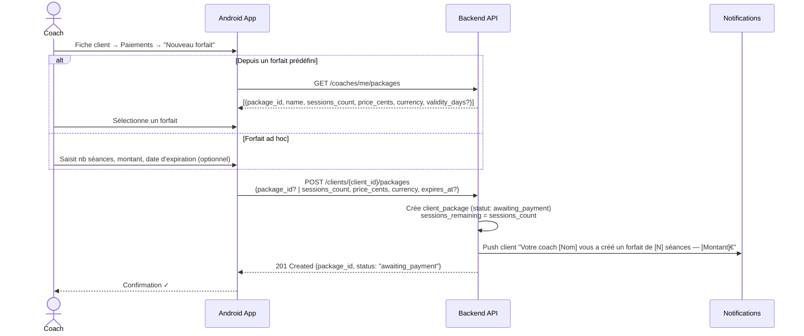
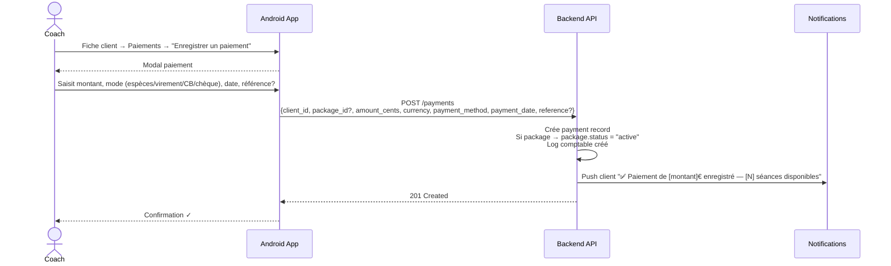
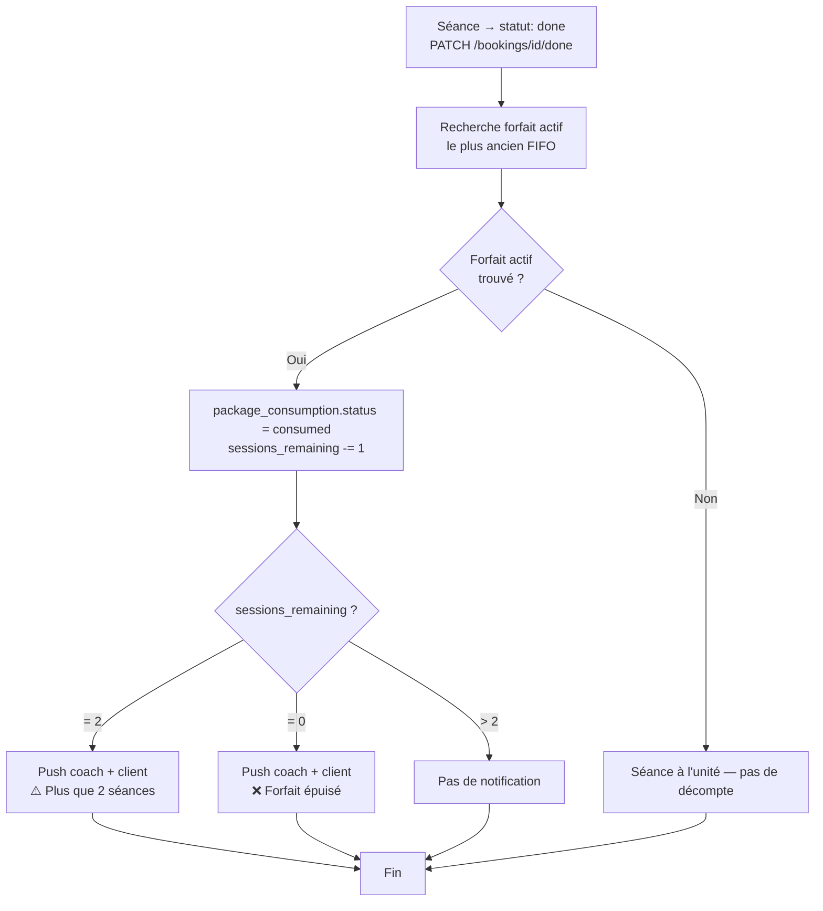
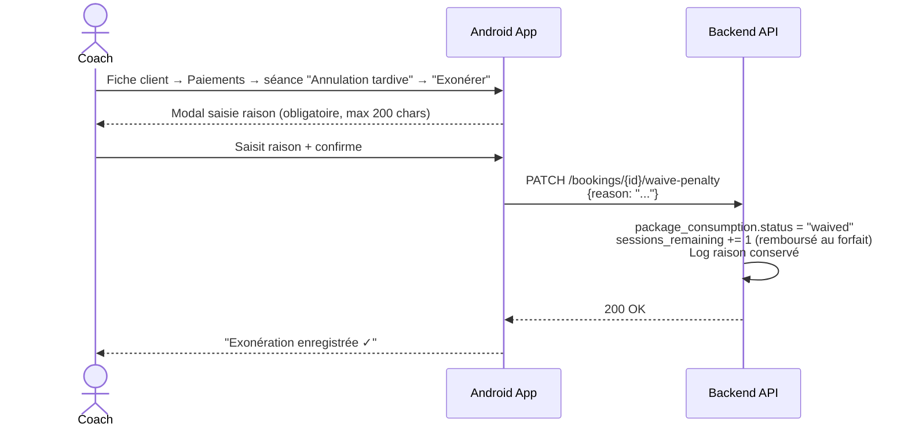
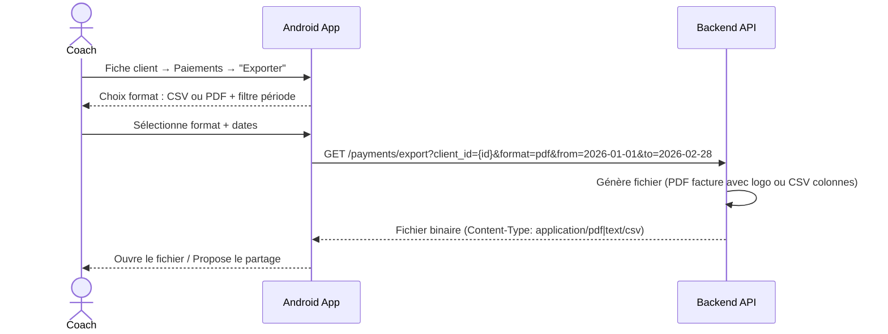
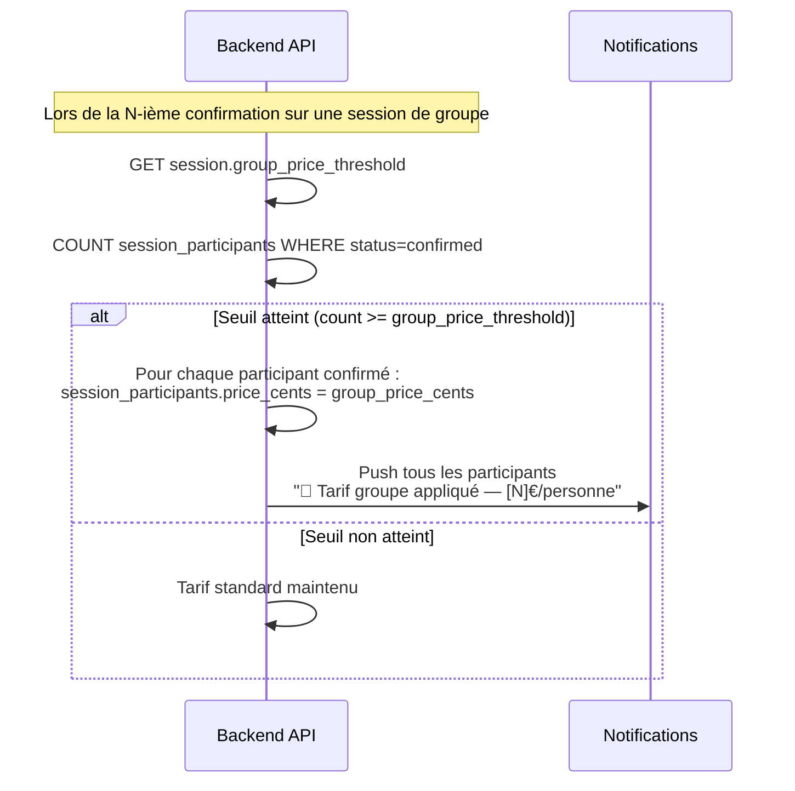

# MyCoach — Flux Paiements & Forfaits

> Flux technico-fonctionnels entre l'application Android et le backend FastAPI.

---

## 1. Création d'un forfait pour un client



---

## 2. Enregistrement d'un paiement



---

## 3. Décompte automatique des séances



---

## 4. Traçabilité des consommations (package_consumptions)

```mermaid
stateDiagram-v2
    direction LR

    [*] --> pending : Séance confirmée<br/>POST /bookings

    pending --> consumed : Séance réalisée<br/>statut: done
    pending --> due : Annulation tardive client<br/>ou No-show (politique "due")
    pending --> cancelled : Annulation normale<br/>(non décomptée)
    pending --> waived : Exonération coach<br/>PATCH /bookings/id/waive-penalty

    consumed --> [*]
    due --> [*]
    cancelled --> [*]
    waived --> [*]

    note right of pending : Permet de savoir à tout instant :<br/>séances consommées / dues / en attente
```

---

## 5. Exonération d'une pénalité (annulation tardive)



---

## 6. Export des paiements



---

## 7. Tarif groupe — Recalcul automatique


