# MyCoach — Flux Paiements & Forfaits

> Flux technico-fonctionnels entre l'application Android et le backend FastAPI.

---

## 1. Création d'un forfait pour un client

```mermaid
sequenceDiagram
    actor K as Coach
    participant A as Android App
    participant B as Backend API
    participant N as Notifications

    K->>A: Fiche client → Paiements → "Nouveau forfait"

    alt Depuis un forfait prédéfini
        A->>B: GET /coaches/me/packages
        B-->>A: [{package_id, name, sessions_count, price_cents, currency, validity_days?}]
        K->>A: Sélectionne un forfait
    else Forfait ad hoc
        K->>A: Saisit nb séances, montant, date d'expiration (optionnel)
    end

    A->>B: POST /clients/{client_id}/packages<br/>{package_id? | sessions_count, price_cents, currency, expires_at?}
    B->>B: Crée client_package (statut: awaiting_payment)<br/>sessions_remaining = sessions_count
    B->>N: Push client "Votre coach [Nom] vous a créé un forfait de [N] séances — [Montant]€"
    B-->>A: 201 Created {package_id, status: "awaiting_payment"}
    A-->>K: Confirmation ✓
```



---

## 2. Enregistrement d'un paiement

```mermaid
sequenceDiagram
    actor K as Coach
    participant A as Android App
    participant B as Backend API
    participant N as Notifications

    K->>A: Fiche client → Paiements → "Enregistrer un paiement"
    A-->>K: Modal paiement
    K->>A: Saisit montant, mode (espèces/virement/CB/chèque), date, référence?
    A->>B: POST /payments<br/>{client_id, package_id?, amount_cents, currency, payment_method, payment_date, reference?}
    B->>B: Crée payment record<br/>Si package → package.status = "active"<br/>Log comptable créé
    B->>N: Push client "✅ Paiement de [montant]€ enregistré — [N] séances disponibles"
    B-->>A: 201 Created
    A-->>K: Confirmation ✓
```



---

## 3. Décompte automatique des séances

```mermaid
flowchart TD
    A[Séance → statut: done<br/>PATCH /bookings/id/done] --> B[Recherche forfait actif<br/>le plus ancien FIFO]
    B --> C{Forfait actif<br/>trouvé ?}
    C -->|Non| D[Séance à l'unité — pas de décompte]
    C -->|Oui| E[package_consumption.status = consumed<br/>sessions_remaining -= 1]
    E --> F{sessions_remaining ?}
    F -->|= 2| G[Push coach + client<br/>⚠️ Plus que 2 séances]
    F -->|= 0| H[Push coach + client<br/>❌ Forfait épuisé]
    F -->|> 2| I[Pas de notification]
    G --> J[Fin]
    H --> J
    I --> J
    D --> J
```



---

## 4. Traçabilité des consommations (package_consumptions)

```mermaid
stateDiagram-v2
    direction LR

    [*] --> pending : Séance confirmée<br/>POST /bookings

    pending --> consumed : Séance réalisée<br/>statut: done
    pending --> due : Annulation tardive client<br/>ou No-show (politique "due")
    pending --> cancelled : Annulation normale<br/>(non décomptée)
    pending --> waived : Exonération coach<br/>PATCH /bookings/id/waive-penalty

    consumed --> [*]
    due --> [*]
    cancelled --> [*]
    waived --> [*]

    note right of pending : Permet de savoir à tout instant :<br/>séances consommées / dues / en attente
```

---

## 5. Exonération d'une pénalité (annulation tardive)

```mermaid
sequenceDiagram
    actor K as Coach
    participant A as Android App
    participant B as Backend API

    K->>A: Fiche client → Paiements → séance "Annulation tardive" → "Exonérer"
    A-->>K: Modal saisie raison (obligatoire, max 200 chars)
    K->>A: Saisit raison + confirme
    A->>B: PATCH /bookings/{id}/waive-penalty<br/>{reason: "..."}
    B->>B: package_consumption.status = "waived"<br/>sessions_remaining += 1 (remboursé au forfait)<br/>Log raison conservé
    B-->>A: 200 OK
    A-->>K: "Exonération enregistrée ✓"
```



---

## 6. Export des paiements

```mermaid
sequenceDiagram
    actor K as Coach
    participant A as Android App
    participant B as Backend API

    K->>A: Fiche client → Paiements → "Exporter"
    A-->>K: Choix format : CSV ou PDF + filtre période
    K->>A: Sélectionne format + dates
    A->>B: GET /payments/export?client_id={id}&format=pdf&from=2026-01-01&to=2026-02-28
    B->>B: Génère fichier (PDF facture avec logo ou CSV colonnes)
    B-->>A: Fichier binaire (Content-Type: application/pdf|text/csv)
    A-->>K: Ouvre le fichier / Propose le partage
```



---

## 7. Tarif groupe — Recalcul automatique

```mermaid
sequenceDiagram
    participant B as Backend API
    participant N as Notifications

    note over B: Lors de la N-ième confirmation sur une session de groupe

    B->>B: GET session.group_price_threshold
    B->>B: COUNT session_participants WHERE status=confirmed

    alt Seuil atteint (count >= group_price_threshold)
        B->>B: Pour chaque participant confirmé :<br/>session_participants.price_cents = group_price_cents
        B->>N: Push tous les participants<br/>"🎉 Tarif groupe appliqué — [N]€/personne"
    else Seuil non atteint
        B->>B: Tarif standard maintenu
    end
```


