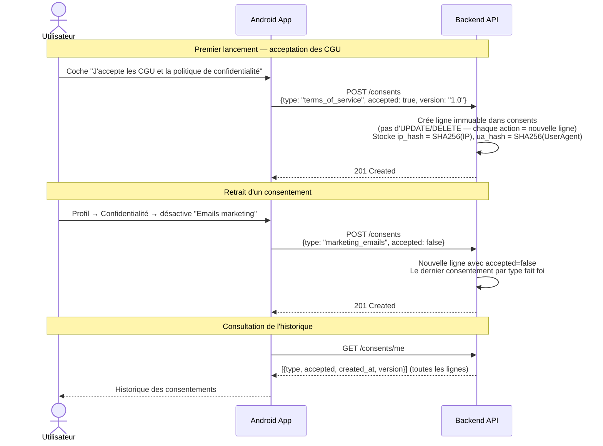

# MyCoach — Flux Intégrations & RGPD

> Flux technico-fonctionnels entre l'application Android et le backend FastAPI.

---

## 1. Connexion Google Calendar (OAuth2)


---

## 2. Connexion Strava (OAuth2)


---

## 3. Balance connectée Withings (OAuth2)


---

## 4. Architecture de chiffrement des tokens OAuth


---

## 5. RGPD — Export des données utilisateur


---

## 6. RGPD — Suppression du compte


---

## 7. RGPD — Gestion des consentements



---

## 8. Headers de sécurité (middleware)

```mermaid
flowchart TD
    REQ[Requête Android<br/>GET|POST|PATCH|DELETE] --> MW[ASGI Security Middleware]

    MW --> H1[X-Content-Type-Options: nosniff]
    MW --> H2[X-Frame-Options: DENY]
    MW --> H3[X-XSS-Protection: 1; mode=block]
    MW --> H4[Referrer-Policy: strict-origin-when-cross-origin]
    MW --> H5[Cache-Control: no-store<br/>sur les routes /auth/*]

    H1 & H2 & H3 & H4 & H5 --> RESP[Réponse au client]

    note1[Server: header supprimé\npour ne pas révéler la stack technique]
    RESP --> note1
```
