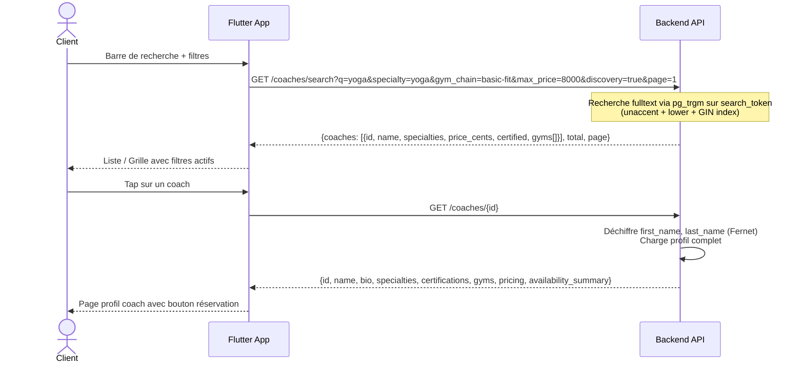
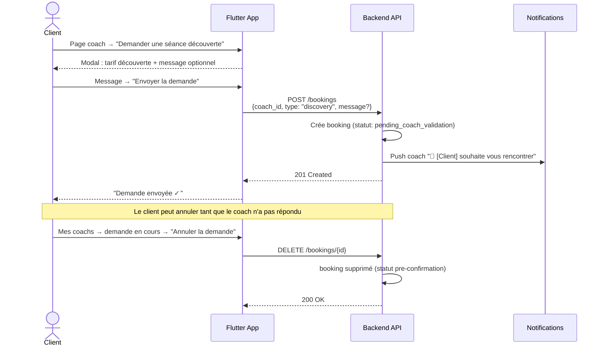
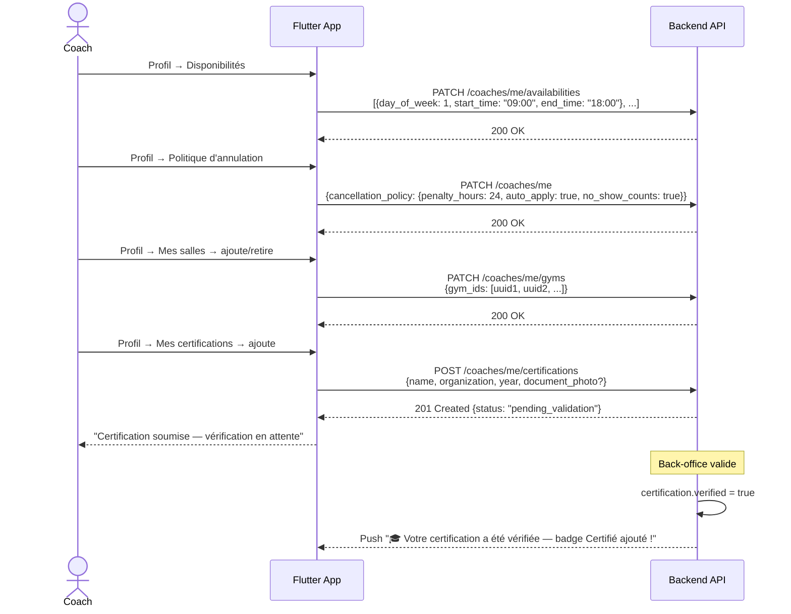
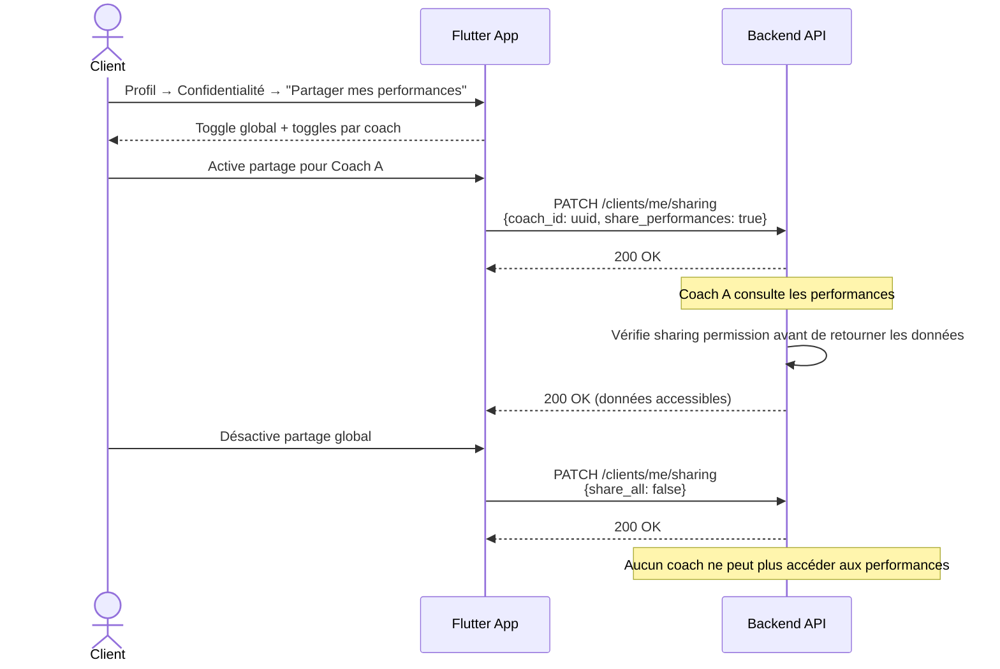
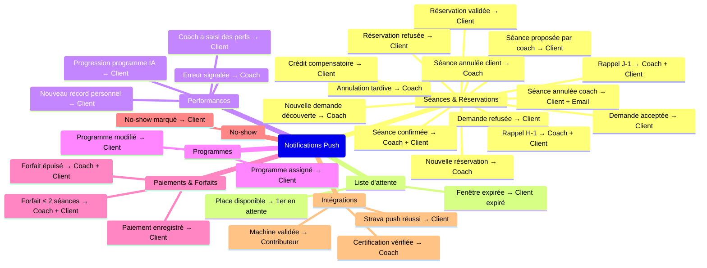
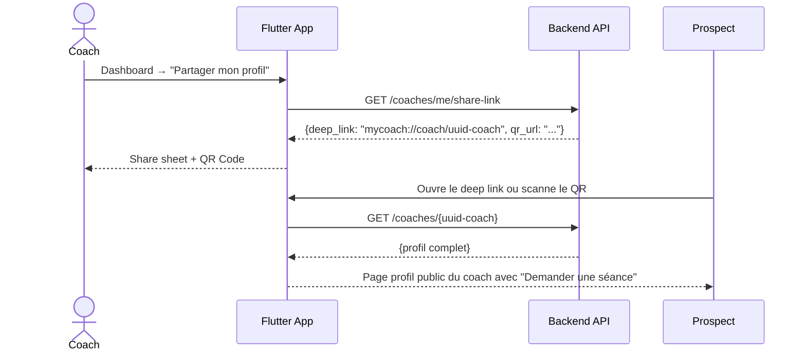
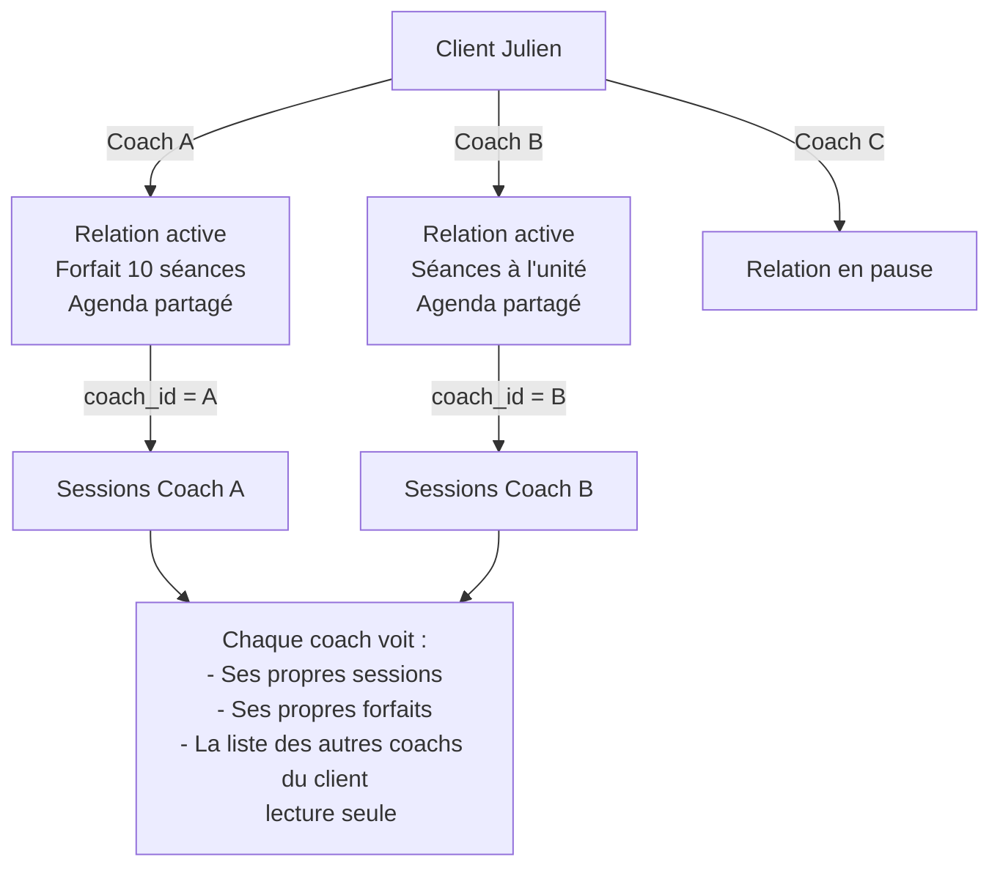
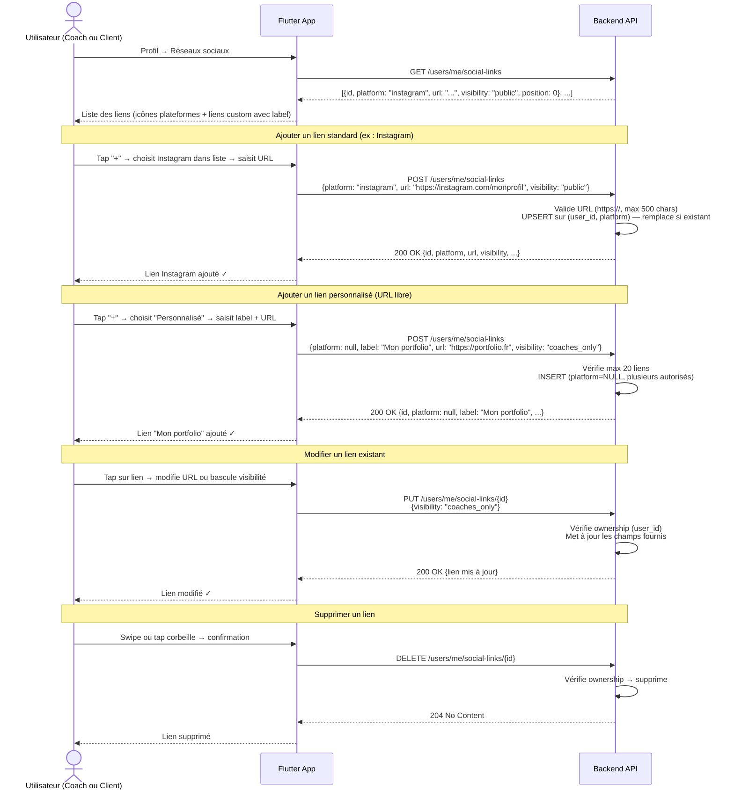
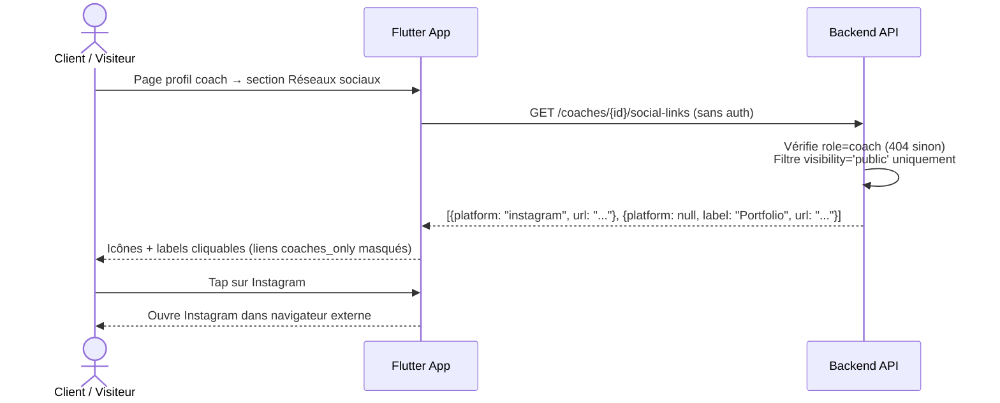

# MyCoach — Flux Profil Coach & Notifications

> Flux technico-fonctionnels entre l'application Android et le backend FastAPI.

---

## 1. Recherche et découverte d'un coach



---

## 2. Demande de séance découverte



---

## 3. Paramètres du profil coach



---

## 4. Paramètres de confidentialité du client



---

## 5. Catalogue complet des notifications push



---

## 6. Profil partageable — Deep link



---

## 7. Gestion multi-coach (client avec plusieurs coachs)



---

## 8. Gestion des liens réseaux sociaux



### Visibilité des liens

```mermaid
flowchart LR
    LINK[Lien réseau social]

    LINK -->|visibility = public| PUB[Visible par tous\nvisiteurs · clients · coachs]
    LINK -->|visibility = coaches_only| PRIV[Visible uniquement\npar coachs avec relation active]

    PUB --> COACH_PROFILE[GET /coaches/{id}/social-links\nRetourné ✓]
    PRIV --> COACH_PROFILE_HIDDEN[GET /coaches/{id}/social-links\nFiltré — non retourné]
    PRIV --> SELF[GET /users/me/social-links\nToujours visible par le propriétaire ✓]
```

### Accès public aux liens d'un coach


