# MyCoach — Flux Profil Coach & Notifications

> Flux technico-fonctionnels entre l'application Android et le backend FastAPI.

---

## 1. Recherche et découverte d'un coach

```mermaid
sequenceDiagram
    actor C as Client
    participant A as Flutter App
    participant B as Backend API

    C->>A: Barre de recherche + filtres
    A->>B: GET /coaches/search?q=yoga&specialty=yoga&gym_chain=basic-fit&max_price=8000&discovery=true&page=1
    note over B: Recherche fulltext via pg_trgm sur search_token<br/>(unaccent + lower + GIN index)
    B-->>A: {coaches: [{id, name, specialties, price_cents, certified, gyms[]}], total, page}
    A-->>C: Liste / Grille avec filtres actifs

    C->>A: Tap sur un coach
    A->>B: GET /coaches/{id}
    B->>B: Déchiffre first_name, last_name (Fernet)<br/>Charge profil complet
    B-->>A: {id, name, bio, specialties, certifications, gyms, pricing, availability_summary}
    A-->>C: Page profil coach avec bouton réservation
```



---

## 2. Demande de séance découverte

```mermaid
sequenceDiagram
    actor C as Client
    participant A as Flutter App
    participant B as Backend API
    participant N as Notifications

    C->>A: Page coach → "Demander une séance découverte"
    A-->>C: Modal : tarif découverte + message optionnel
    C->>A: Message → "Envoyer la demande"
    A->>B: POST /bookings<br/>{coach_id, type: "discovery", message?}
    B->>B: Crée booking (statut: pending_coach_validation)
    B->>N: Push coach "👋 [Client] souhaite vous rencontrer"
    B-->>A: 201 Created
    A-->>C: "Demande envoyée ✓"

    note over C,B: Le client peut annuler tant que le coach n'a pas répondu
    C->>A: Mes coachs → demande en cours → "Annuler la demande"
    A->>B: DELETE /bookings/{id}
    B->>B: booking supprimé (statut pre-confirmation)
    B-->>A: 200 OK
```



---

## 3. Paramètres du profil coach

```mermaid
sequenceDiagram
    actor K as Coach
    participant A as Flutter App
    participant B as Backend API

    K->>A: Profil → Disponibilités
    A->>B: PATCH /coaches/me/availabilities<br/>[{day_of_week: 1, start_time: "09:00", end_time: "18:00"}, ...]
    B-->>A: 200 OK

    K->>A: Profil → Politique d'annulation
    A->>B: PATCH /coaches/me<br/>{cancellation_policy: {penalty_hours: 24, auto_apply: true, no_show_counts: true}}
    B-->>A: 200 OK

    K->>A: Profil → Mes salles → ajoute/retire
    A->>B: PATCH /coaches/me/gyms<br/>{gym_ids: [uuid1, uuid2, ...]}
    B-->>A: 200 OK

    K->>A: Profil → Mes certifications → ajoute
    A->>B: POST /coaches/me/certifications<br/>{name, organization, year, document_photo?}
    B-->>A: 201 Created {status: "pending_validation"}
    A-->>K: "Certification soumise — vérification en attente"

    note over B: Back-office valide
    B->>B: certification.verified = true
    B-->>A: Push "🎓 Votre certification a été vérifiée — badge Certifié ajouté !"
```



---

## 4. Paramètres de confidentialité du client

```mermaid
sequenceDiagram
    actor C as Client
    participant A as Flutter App
    participant B as Backend API

    C->>A: Profil → Confidentialité → "Partager mes performances"
    A-->>C: Toggle global + toggles par coach

    C->>A: Active partage pour Coach A
    A->>B: PATCH /clients/me/sharing<br/>{coach_id: uuid, share_performances: true}
    B-->>A: 200 OK

    note over B: Coach A consulte les performances
    B->>B: Vérifie sharing permission avant de retourner les données
    B-->>A: 200 OK (données accessibles)

    C->>A: Désactive partage global
    A->>B: PATCH /clients/me/sharing<br/>{share_all: false}
    B-->>A: 200 OK
    note over B: Aucun coach ne peut plus accéder aux performances
```



---

## 5. Catalogue complet des notifications push

```mermaid
mindmap
  root(Notifications Push)
    Séances & Réservations
      Nouvelle demande découverte → Coach
      Demande acceptée → Client
      Demande refusée → Client
      Nouvelle réservation → Coach
      Réservation validée → Client
      Réservation refusée → Client
      Séance proposée par coach → Client
      Séance confirmée → Coach + Client
      Séance annulée client → Coach
      Séance annulée coach → Client + Email
      Annulation tardive → Coach
      Crédit compensatoire → Client
      Rappel J-1 → Coach + Client
      Rappel H-1 → Coach + Client
    Liste d'attente
      Place disponible → 1er en attente
      Fenêtre expirée → Client expiré
    Performances
      Coach a saisi des perfs → Client
      Erreur signalée → Coach
      Nouveau record personnel → Client
      Progression programme IA → Client
    Programmes
      Programme assigné → Client
      Programme modifié → Client
    Paiements & Forfaits
      Forfait ≤ 2 séances → Coach + Client
      Forfait épuisé → Coach + Client
      Paiement enregistré → Client
    No-show
      No-show marqué → Client
    Intégrations
      Strava push réussi → Client
      Machine validée → Contributeur
      Certification vérifiée → Coach
```



---

## 6. Profil partageable — Deep link

```mermaid
sequenceDiagram
    actor K as Coach
    participant A as Flutter App
    participant B as Backend API
    participant C as Prospect

    K->>A: Dashboard → "Partager mon profil"
    A->>B: GET /coaches/me/share-link
    B-->>A: {deep_link: "mycoach://coach/uuid-coach", qr_url: "..."}
    A-->>K: Share sheet + QR Code

    C->>A: Ouvre le deep link ou scanne le QR
    A->>B: GET /coaches/{uuid-coach}
    B-->>A: {profil complet}
    A-->>C: Page profil public du coach avec "Demander une séance"
```



---

## 7. Gestion multi-coach (client avec plusieurs coachs)

```mermaid
flowchart TD
    CLIENT[Client Julien]

    CLIENT -->|Coach A| R1[Relation active\nForfait 10 séances\nAgenda partagé]
    CLIENT -->|Coach B| R2[Relation active\nSéances à l'unité\nAgenda partagé]
    CLIENT -->|Coach C| R3[Relation en pause]

    R1 -->|coach_id = A| S1[Sessions Coach A]
    R2 -->|coach_id = B| S2[Sessions Coach B]

    note1[Chaque coach voit :\n- Ses propres sessions\n- Ses propres forfaits\n- La liste des autres coachs du client\n  lecture seule]

    S1 --> note1
    S2 --> note1
```



---

## 8. Gestion des liens réseaux sociaux

```mermaid
sequenceDiagram
    actor U as Utilisateur (Coach ou Client)
    participant A as Flutter App
    participant B as Backend API

    U->>A: Profil → Réseaux sociaux
    A->>B: GET /users/me/social-links
    B-->>A: [{id, platform: "instagram", url: "...", visibility: "public", position: 0}, ...]
    A-->>U: Liste des liens (icônes plateformes + liens custom avec label)

    note over U,B: Ajouter un lien standard (ex : Instagram)
    U->>A: Tap "+" → choisit Instagram dans liste → saisit URL
    A->>B: POST /users/me/social-links<br/>{platform: "instagram", url: "https://instagram.com/monprofil", visibility: "public"}
    B->>B: Valide URL (https://, max 500 chars)<br/>UPSERT sur (user_id, platform) — remplace si existant
    B-->>A: 200 OK {id, platform, url, visibility, ...}
    A-->>U: Lien Instagram ajouté ✓

    note over U,B: Ajouter un lien personnalisé (URL libre)
    U->>A: Tap "+" → choisit "Personnalisé" → saisit label + URL
    A->>B: POST /users/me/social-links<br/>{platform: null, label: "Mon portfolio", url: "https://portfolio.fr", visibility: "coaches_only"}
    B->>B: Vérifie max 20 liens<br/>INSERT (platform=NULL, plusieurs autorisés)
    B-->>A: 200 OK {id, platform: null, label: "Mon portfolio", ...}
    A-->>U: Lien "Mon portfolio" ajouté ✓

    note over U,B: Modifier un lien existant
    U->>A: Tap sur lien → modifie URL ou bascule visibilité
    A->>B: PUT /users/me/social-links/{id}<br/>{visibility: "coaches_only"}
    B->>B: Vérifie ownership (user_id)<br/>Met à jour les champs fournis
    B-->>A: 200 OK {lien mis à jour}
    A-->>U: Lien modifié ✓

    note over U,B: Supprimer un lien
    U->>A: Swipe ou tap corbeille → confirmation
    A->>B: DELETE /users/me/social-links/{id}
    B->>B: Vérifie ownership → supprime
    B-->>A: 204 No Content
    A-->>U: Lien supprimé
```



### Visibilité des liens

```mermaid
flowchart LR
    LINK[Lien réseau social]

    LINK -->|visibility = public| PUB[Visible par tous\nvisiteurs · clients · coachs]
    LINK -->|visibility = coaches_only| PRIV[Visible uniquement\npar coachs avec relation active]

    PUB --> COACH_PROFILE[GET /coaches/{id}/social-links\nRetourné ✓]
    PRIV --> COACH_PROFILE_HIDDEN[GET /coaches/{id}/social-links\nFiltré — non retourné]
    PRIV --> SELF[GET /users/me/social-links\nToujours visible par le propriétaire ✓]
```

### Accès public aux liens d'un coach

```mermaid
sequenceDiagram
    actor C as Client / Visiteur
    participant A as Flutter App
    participant B as Backend API

    C->>A: Page profil coach → section Réseaux sociaux
    A->>B: GET /coaches/{id}/social-links (sans auth)
    B->>B: Vérifie role=coach (404 sinon)<br/>Filtre visibility='public' uniquement
    B-->>A: [{platform: "instagram", url: "..."}, {platform: null, label: "Portfolio", url: "..."}]
    A-->>C: Icônes + labels cliquables (liens coaches_only masqués)
    C->>A: Tap sur Instagram
    A-->>C: Ouvre Instagram dans navigateur externe
```


